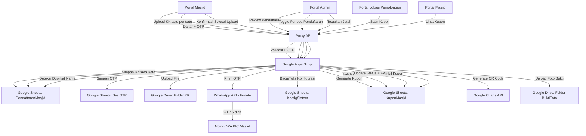
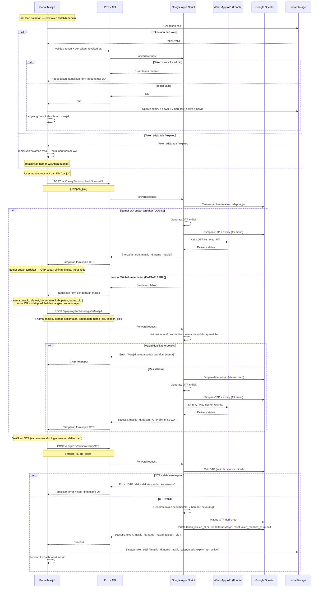
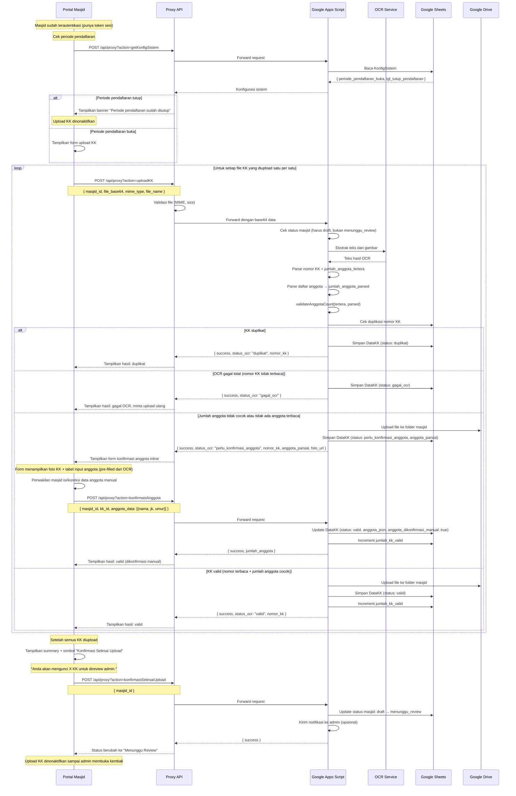
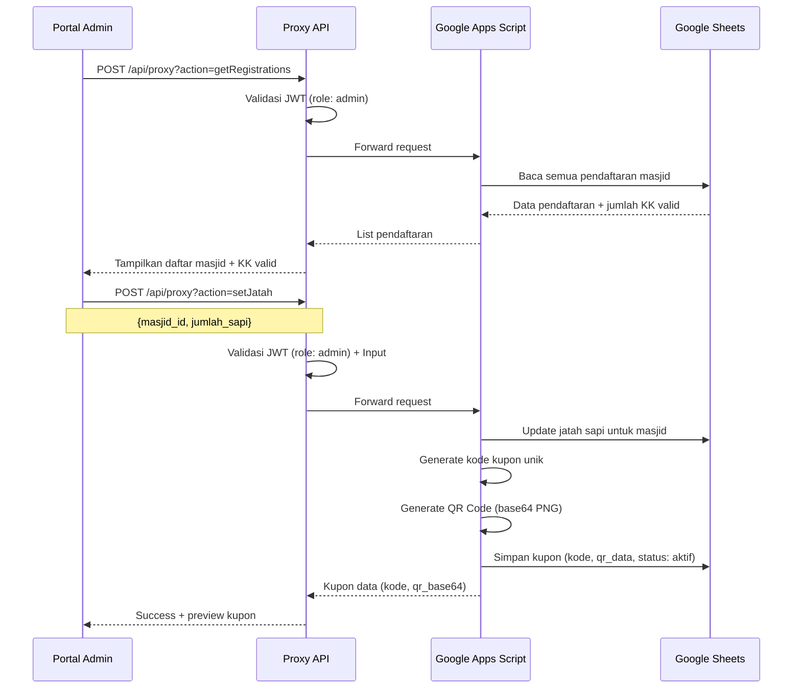
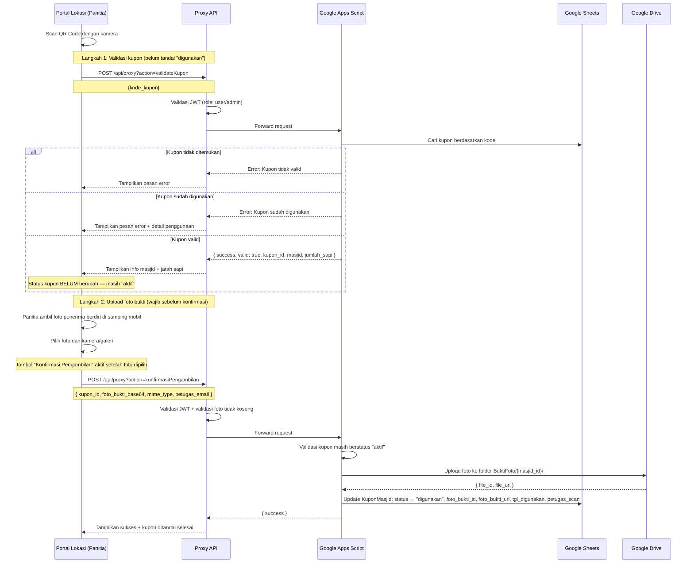

# Design Document: Sistem Barcode Kupon Kurban

## Overview

Sistem Barcode Kupon Kurban adalah fitur baru yang memungkinkan masjid-masjid mendaftar sebagai penerima manfaat kurban dengan mengunggah data Kartu Keluarga (KK) calon penerima. Sistem menggunakan OCR untuk mendeteksi nomor KK dan mencegah duplikasi. Admin kemudian menentukan jatah sapi berdasarkan jumlah KK valid, dan sistem menghasilkan kupon digital dengan barcode/QR code unik untuk setiap masjid. Kupon ini digunakan saat pengambilan sapi di lokasi pemotongan terpusat, dengan verifikasi scan untuk mencegah kecurangan.

Fitur ini menambahkan alur kerja baru ke dalam aplikasi Kurban Digital yang sudah ada, dengan portal baru untuk masjid dan ekstensi portal admin untuk manajemen pendaftaran, validasi OCR, dan penerbitan kupon.

## Architecture



## Sequence Diagrams

### Alur Autentikasi Masjid via OTP WhatsApp



### Alur Pendaftaran Masjid dan Upload KK (Single Upload)



### Alur Penetapan Jatah dan Penerbitan Kupon



### Alur Scan Kupon di Lokasi (Dua Langkah: Validasi + Foto Bukti)



## Components and Interfaces

### Komponen 1: Portal Masjid (`masjid/index.html`)

**Tujuan**: Antarmuka bagi perwakilan masjid untuk mendaftar via OTP WhatsApp, mengunggah data KK satu per satu, dan mengkonfirmasi selesai upload.

**Interface**:
```javascript
// Autentikasi via OTP WhatsApp — alur satu halaman cerdas
async function checkNomorWA(teleponPic)
// Cek apakah nomor WA sudah terdaftar di sistem
// return: { terdaftar: boolean, masjid_id?: string, nama_masjid?: string }
// Efek samping: jika terdaftar → kirim OTP otomatis ke nomor tersebut

async function registerMasjid(dataMasjid)
// dataMasjid: { nama_masjid, alamat, kecamatan, kabupaten, nama_pic, telepon_pic }
// return: { success, masjid_id, pesan }
// Efek samping: mengirim OTP ke nomor WA PIC

async function verifyOTP(masjidId, otpCode)
// return: { success, token, masjid_id, nama_masjid, telepon_pic }
// Efek samping: menyimpan token sesi ke localStorage (expiry 7 hari, last_active = now())
//               token_issued_at diperbarui di PendaftaranMasjid, token_revoked_at di-reset ke null

async function requestOTP(teleponPic)
// Untuk kunjungan berikutnya saat token expired atau di-revoke
// return: { success, masjid_id }

// Upload KK satu per satu
async function uploadKK(masjidId, fileData)
// fileData: { base64Data, mimeType, fileName }
// return: { success, status_ocr, nomor_kk, anggota_parsial?, foto_url? }
// Jika status_ocr = "perlu_konfirmasi_anggota": response menyertakan foto_url dan anggota_parsial (bisa kosong)

// Konfirmasi data anggota secara manual oleh perwakilan masjid
async function konfirmasiAnggota(masjidId, kkId, anggotaData)
// anggotaData: [{ nama, jk, umur }] — array anggota yang dikonfirmasi manual
// return: { success, jumlah_anggota }
// Efek samping: status_ocr berubah dari "perlu_konfirmasi_anggota" → "valid", jumlah_kk_valid bertambah 1

// Konfirmasi selesai upload
async function konfirmasiSelesaiUpload(masjidId)
// return: { success }
// Efek samping: status masjid berubah draft → menunggu_review, upload dinonaktifkan

async function getKuponMasjid(masjidId)
// return: { success, kupon: { kode, qr_base64, jumlah_sapi, status } }

// Manajemen sesi
function getSessionToken()
// return: { masjid_id, nama_masjid, telepon_pic, expiry, last_active } | null

function isSessionValid()
// return: boolean (cek expiry token di localStorage)
// Efek samping: jika valid, panggil refreshToken() otomatis untuk perpanjang 7 hari

function refreshToken(session)
// Perpanjang token 7 hari dari sekarang (dipanggil otomatis setiap load halaman / aksi)
// Efek samping: update expiry = now() + 7 hari, last_active = now() di localStorage
```

**Tanggung Jawab**:
- Halaman awal: satu input nomor WA + tombol "Lanjut" (tidak ada tombol "Daftar" dan "Login" yang terpisah)
- Saat load halaman: cek token di localStorage terlebih dahulu — jika valid langsung masuk dashboard tanpa perlu input apapun
- Jika token tidak ada/expired: tampilkan form input nomor WA
- Sistem cek nomor WA: jika terdaftar → OTP dikirim otomatis → tampilkan form OTP (LOGIN); jika belum terdaftar → tampilkan form pendaftaran dengan nomor WA sudah pre-filled (DAFTAR BARU)
- Alur OTP: input kode OTP → simpan token sesi di localStorage → masuk dashboard
- Tampilkan banner jika periode pendaftaran sudah ditutup admin
- Upload file KK satu per satu dengan feedback status per file (valid/duplikat/perlu_konfirmasi_anggota/gagal_ocr)
- Jika status `perlu_konfirmasi_anggota`: langsung tampilkan form konfirmasi anggota inline di halaman yang sama
  - Foto KK ditampilkan di sisi kiri/atas agar perwakilan masjid bisa melihat sambil mengisi
  - Tabel input anggota: baris per anggota dengan kolom Nama, Jenis Kelamin (L/P), Umur
  - Baris yang sudah berhasil di-parse OCR ditampilkan sebagai pre-filled (bisa diedit)
  - Tombol "Tambah Anggota" untuk menambah baris baru
  - Tombol "Konfirmasi Data Anggota" untuk submit
- Tampilkan counter KK yang sudah diupload secara real-time
- Tombol "Konfirmasi Selesai Upload" dengan summary sebelum konfirmasi
- Setelah konfirmasi: upload dinonaktifkan, tampilkan status "Menunggu Review"
- Tampilkan kupon digital dengan QR code untuk diunduh/dicetak

### Komponen 2: Ekstensi Portal Admin (`admin/index.html`)

**Tujuan**: Tab baru di portal admin untuk mengelola pendaftaran masjid, toggle periode pendaftaran, menerbitkan kupon, dan mereview KK yang memerlukan verifikasi manual.

**Interface**:
```javascript
async function getRegistrations()
// return: { success, data: Pendaftaran[] }

async function setJatah(masjidId, jumlahSapi)
// return: { success, kupon: { kode, qr_base64 } }

async function getKKDetail(masjidId)
// return: { success, data: DataKK[] }
// DataKK kini menyertakan: jumlah_anggota_tertera, jumlah_anggota_parsed, discrepancy_note

async function getKKPerluVerifikasi(masjidId)
// return: { success, data: DataKK[] } — hanya KK dengan status_ocr: "perlu_verifikasi" (kasus mencurigakan, bukan discrepancy anggota)

async function resolveKKVerifikasi(kkId, action, koreksiData)
// action: "terima" | "tolak" | "koreksi"
// koreksiData: { nomor_kk?, jumlah_anggota_tertera? } — opsional, hanya untuk action "koreksi"
// return: { success }

async function rejectRegistration(masjidId, alasan)
// return: { success }

// Revoke token sesi masjid (paksa logout)
async function revokeTokenMasjid(masjidId)
// return: { success }
// Efek samping: token_revoked_at diset ke now() di PendaftaranMasjid
//               masjid harus OTP ulang untuk bisa akses portal

// Kontrol periode pendaftaran
async function getKonfigSistem()
// return: { success, config: { periode_pendaftaran_buka, tgl_tutup_pendaftaran } }

async function togglePeriodePendaftaran(buka)
// buka: boolean (true = buka, false = tutup)
// return: { success }

async function updateNomorWAMasjid(masjidId, nomorWaBaru, adminEmail)
// return: { success }
// Efek samping: telepon_pic di PendaftaranMasjid diperbarui ke nomorWaBaru
// Catatan: Admin harus verifikasi identitas masjid secara manual sebelum menggunakan fungsi ini

// Hapus dan blokir masjid
async function hapusMasjid(masjidId, adminEmail)
// return: { success }
// Efek samping: menghapus data masjid dan semua DataKK miliknya dari sistem
// Catatan: Gagal jika masjid memiliki kupon dengan status "aktif"

async function blokirMasjid(masjidId, alasan, adminEmail)
// return: { success }
// Efek samping: status masjid berubah ke "diblokir", token sesi di-revoke, alasan & admin_pemblokir & tgl_diblokir dicatat

async function bukaBlokirMasjid(masjidId, adminEmail)
// return: { success }
// Efek samping: status masjid dikembalikan ke status sebelum diblokir, catatan pemblokiran dihapus

async function blokirNomorWA(nomorWA, adminEmail)
// return: { success }
// Efek samping: nomor WA ditambahkan ke KonfigSistem.nomor_diblokir

async function bukaBlokirNomorWA(nomorWA, adminEmail)
// return: { success }
// Efek samping: nomor WA dihapus dari KonfigSistem.nomor_diblokir

async function getNomorDiblokir()
// return: { success, data: string[] } — daftar nomor WA yang diblokir
```

**Tanggung Jawab**:
- Tabel daftar pendaftaran masjid dengan status
- Tombol toggle "Buka/Tutup Pendaftaran" di tab Kupon/Masjid
- Tampilkan status periode pendaftaran (buka/tutup) dengan tanggal tutup
- Detail KK per masjid (nama, jenis kelamin, umur, jumlah anggota tertera vs parsed)
- Tab/filter khusus untuk KK dengan `status_ocr: "perlu_verifikasi"` — menampilkan kasus mencurigakan yang memerlukan review admin (bukan discrepancy anggota biasa)
- Form resolusi verifikasi: admin bisa terima, tolak, atau koreksi manual data KK
- Form penetapan jatah sapi
- Preview dan unduh kupon yang sudah diterbitkan
- Tombol "Revoke Token" per masjid — untuk memaksa logout masjid tertentu (misal jika PIC lapor HP hilang)

### Komponen 3: Portal Lokasi Pemotongan (ekstensi `user/index.html`)

**Tujuan**: Tab baru di portal panitia untuk scan dan validasi kupon di lokasi, dengan alur dua langkah: validasi kupon → upload foto bukti → konfirmasi pengambilan.

**Interface**:
```javascript
// Langkah 1: Validasi kupon — hanya cek valid/sudah digunakan/tidak ditemukan
// TIDAK mengubah status kupon ke "digunakan"
async function validateKupon(kodeKupon)
// return: { success, valid: true, kupon_id, masjid: MasjidInfo, jumlah_sapi }
//       | { success: false, error: string }

// Langkah 2: Konfirmasi pengambilan dengan foto bukti (wajib)
// Mengubah status kupon ke "digunakan" setelah foto berhasil diupload
async function konfirmasiPengambilan(kuponId, fotoBuktiBase64, mimeType, petugasEmail)
// return: { success }
// Efek samping: foto tersimpan di Drive folder BuktiFoto/{masjid_id}/,
//               status kupon berubah ke "digunakan", foto_bukti_id & foto_bukti_url terisi

function initQRScanner(videoElementId, onScanCallback)
// Inisialisasi kamera untuk scan QR code

function stopQRScanner()
// Hentikan kamera
```

**Tanggung Jawab**:
- Antarmuka scan QR code menggunakan kamera perangkat
- Input manual kode kupon sebagai fallback
- Setelah scan QR berhasil validasi → tampilkan info masjid + jatah sapi
- Tampilkan area upload foto dengan instruksi: "Foto penerima berdiri di samping mobil pengambilan"
- Tombol "Konfirmasi Pengambilan" hanya aktif setelah foto dipilih
- Setelah konfirmasi berhasil → tampilkan sukses + kupon ditandai selesai
- Riwayat scan dalam sesi aktif

### Komponen 4: OCR Service (Google Apps Script)

**Tujuan**: Mengekstrak nomor KK dari gambar yang diunggah menggunakan Google Drive OCR.

**Interface**:
```javascript
// Di Google Apps Script
function extractNomorKK(fileId)
// fileId: ID file di Google Drive
// return: { success, nomor_kk, raw_text }

function parseNomorKK(rawText)
// rawText: teks hasil OCR
// return: string | null (16 digit nomor KK)
```

**Tanggung Jawab**:
- Konversi gambar ke teks menggunakan Google Drive OCR API
- Parsing nomor KK (16 digit) dari teks hasil OCR
- Validasi format nomor KK

### Komponen 5: QR Code Generator (Google Apps Script)

**Tujuan**: Menghasilkan QR code unik untuk setiap kupon masjid.

**Interface**:
```javascript
// Di Google Apps Script
function generateKuponKode(masjidId, jumlahSapi)
// return: string (kode unik, contoh: "BNT-2025-MSJ001-3S")

function generateQRCode(kodeKupon)
// return: string (base64 PNG dari QR code)
// Menggunakan Google Charts API: https://chart.googleapis.com/chart
```

**Tanggung Jawab**:
- Generate kode kupon yang unik dan tidak mudah ditebak
- Generate QR code sebagai gambar PNG (base64)
- Validasi keunikan kode sebelum disimpan


## Data Models

### Model 1: Pendaftaran Masjid

```javascript
// Sheet: PendaftaranMasjid
// Kolom: masjid_id | nama_masjid | nama_normalized | alamat | kecamatan | kabupaten | nama_pic | telepon_pic | status | tgl_daftar | jumlah_kk_valid | jumlah_sapi_jatah | tgl_penetapan | admin_penetap | token_issued_at | token_revoked_at
{
  masjid_id: "MSJ-2025-001",          // Auto-generated, format: MSJ-YYYY-NNN
  nama_masjid: "Masjid Al-Ikhlas",
  nama_normalized: "masjid al ikhlas", // Lowercase, strip tanda baca & spasi berlebih — untuk fuzzy matching
  alamat: "Jl. Merdeka No. 1",
  kecamatan: "Mataram",
  kabupaten: "Kota Mataram",
  nama_pic: "Ahmad Fauzi",
  telepon_pic: "081234567890",
  status: "draft",                    // draft | menunggu_review | disetujui | ditolak | diblokir
  tgl_daftar: "2025-01-15T08:00:00Z",
  jumlah_kk_valid: 45,
  jumlah_sapi_jatah: 3,               // Diisi admin setelah review
  tgl_penetapan: "2025-01-20T10:00:00Z",
  admin_penetap: "admin@bnt.org",
  token_issued_at: "2025-01-15T08:00:00Z",  // Timestamp kapan token terakhir diterbitkan (diperbarui setiap verifyOTP berhasil)
  token_revoked_at: null,                    // Timestamp kapan token di-revoke oleh admin (null jika tidak di-revoke)
  alasan_blokir: null,                       // Alasan pemblokiran (null jika tidak diblokir)
  admin_pemblokir: null,                     // Email admin yang memblokir (null jika tidak diblokir)
  tgl_diblokir: null                         // Timestamp kapan masjid diblokir (null jika tidak diblokir)
}
```

**Aturan Validasi**:
- `masjid_id` unik, auto-generated oleh sistem
- `nama_masjid` tidak boleh kosong, max 200 karakter
- `nama_normalized` di-generate otomatis dari `nama_masjid`: lowercase, strip tanda baca (`-`, `.`, `'`), normalisasi spasi
- `telepon_pic` format nomor Indonesia (08xx atau +628xx)
- `status` hanya boleh nilai yang terdefinisi
- Status flow: `draft` → `menunggu_review` (saat masjid klik konfirmasi selesai upload) → `disetujui` atau `ditolak` (oleh admin)
- Status `diblokir` dapat ditetapkan admin kapan saja; masjid yang diblokir tidak dapat mengakses portal
- Setelah status `menunggu_review`: masjid tidak bisa upload KK tambahan kecuali admin membuka kembali
- `jumlah_sapi_jatah` harus bilangan bulat positif, hanya bisa diisi admin
- Tidak ada batas maksimum jumlah KK per masjid
- `token_issued_at` diperbarui setiap kali `verifyOTP` berhasil
- `token_revoked_at` diset ke `now()` oleh admin saat revoke; di-reset ke `null` setelah OTP baru berhasil diverifikasi
- Jika `token_revoked_at > token_issued_at`: semua request dari portal masjid ditolak sampai OTP baru diverifikasi

### Model 2: Data KK

```javascript
// Sheet: DataKK
// Kolom: kk_id | masjid_id | nomor_kk | file_id | status_ocr | nama_kepala | anggota_json | jumlah_anggota_tertera | jumlah_anggota_parsed | discrepancy_note | anggota_dikonfirmasi_manual | tgl_upload | uploader
{
  kk_id: "KK-2025-001-001",           // Auto-generated
  masjid_id: "MSJ-2025-001",
  nomor_kk: "5271012345678901",        // 16 digit, hasil OCR
  file_id: "1BxiMVs0XRA5nFMdKvBdBZjgmUUqptlbs", // Google Drive file ID
  status_ocr: "valid",                 // valid | duplikat | gagal_ocr | manual | perlu_verifikasi | perlu_konfirmasi_anggota
  nama_kepala: "Ahmad Fauzi",          // Hasil OCR
  anggota_json: "[{\"nama\":\"Siti\",\"jk\":\"P\",\"umur\":35}]", // JSON string
  jumlah_anggota_tertera: 5,           // Angka yang tertera di kolom "Jumlah Anggota Keluarga" pada KK
  jumlah_anggota_parsed: 4,            // Jumlah baris anggota yang berhasil di-parse oleh OCR
  discrepancy_note: "Tertera 5, berhasil di-parse 4. Kemungkinan 1 baris tidak terbaca.", // null jika tidak ada discrepancy
  anggota_dikonfirmasi_manual: false,  // true jika data anggota diisi manual oleh perwakilan masjid (bukan murni OCR)
  tgl_upload: "2025-01-15T08:30:00Z",
  uploader: "pic@masjid.com"
}
```

**Aturan Validasi**:
- `nomor_kk` harus 16 digit angka
- `nomor_kk` unik di seluruh sistem (cek lintas masjid)
- `status_ocr` menentukan apakah KK dihitung dalam `jumlah_kk_valid`:
  - `valid`: dihitung
  - `perlu_konfirmasi_anggota`: **tidak dihitung** sampai perwakilan masjid mengkonfirmasi data anggota
  - `perlu_verifikasi`: **tidak dihitung** sampai admin memutuskan (digunakan untuk kasus mencurigakan, bukan discrepancy anggota biasa)
  - `duplikat`, `gagal_ocr`: tidak dihitung
  - `manual`: dihitung (sudah diverifikasi admin)
- `anggota_json` adalah JSON array dari objek `{nama, jk, umur}`
- `jumlah_anggota_tertera` adalah integer yang diekstrak dari teks KK (bisa null jika tidak ditemukan)
- `jumlah_anggota_parsed` adalah integer hasil hitung baris anggota yang berhasil di-parse
- `discrepancy_note` diisi otomatis jika `jumlah_anggota_tertera ≠ jumlah_anggota_parsed`, null jika sama atau salah satu null
- `anggota_dikonfirmasi_manual` diset `true` saat `konfirmasiAnggota` berhasil dipanggil; default `false`

### Model 3: Kupon Masjid

```javascript
// Sheet: KuponMasjid
// Kolom: kupon_id | masjid_id | kode_kupon | qr_data | jumlah_sapi | status | tgl_terbit | tgl_digunakan | petugas_scan | lokasi_scan | foto_bukti_id | foto_bukti_url
{
  kupon_id: "KPN-2025-001",
  masjid_id: "MSJ-2025-001",
  kode_kupon: "BNT-2025-MSJ001-3S",   // Format: BNT-YYYY-MASJIDID-JUMLAH+S
  qr_data: "BNT-2025-MSJ001-3S",      // Data yang di-encode dalam QR
  jumlah_sapi: 3,
  status: "aktif",                     // aktif | digunakan | dibatalkan
  tgl_terbit: "2025-01-20T10:00:00Z",
  tgl_digunakan: null,
  petugas_scan: null,
  lokasi_scan: null,
  foto_bukti_id: null,                 // Google Drive file ID foto bukti pengambilan
  foto_bukti_url: null                 // URL foto bukti (untuk ditampilkan di portal admin)
}
```

**Aturan Validasi**:
- Satu masjid hanya boleh memiliki satu kupon aktif
- `kode_kupon` unik di seluruh sistem
- Status hanya bisa berubah: `aktif` → `digunakan` atau `aktif` → `dibatalkan`
- `tgl_digunakan` dan `petugas_scan` wajib diisi saat status berubah ke `digunakan`
- `foto_bukti_id` dan `foto_bukti_url` wajib terisi saat status berubah ke `digunakan` — tidak ada pengecualian
- Status tidak dapat berubah ke `digunakan` tanpa `foto_bukti_id` yang valid

### Model 4: Sesi OTP Masjid

```javascript
// Sheet: SesiOTP (atau kolom tambahan di PendaftaranMasjid)
// Kolom: masjid_id | otp_code | otp_expiry | tgl_kirim
{
  masjid_id: "MSJ-2025-001",
  otp_code: "847291",                 // 6 digit angka acak
  otp_expiry: "2025-01-15T08:15:00Z", // 15 menit setelah dikirim
  tgl_kirim: "2025-01-15T08:00:00Z"
}
```

**Aturan Validasi**:
- `otp_code` adalah 6 digit angka, di-generate secara acak
- `otp_expiry` adalah 15 menit setelah `tgl_kirim`
- OTP dihapus dari sheet setelah berhasil diverifikasi
- Maksimum 3 percobaan verifikasi OTP per sesi (anti-brute force)
- Setelah OTP expired, masjid harus request OTP baru

### Model 5: Token Sesi (localStorage)

```javascript
// Disimpan di localStorage browser masjid
// Key: "masjid_session"
{
  masjid_id: "MSJ-2025-001",
  nama_masjid: "Masjid Al-Ikhlas",
  telepon_pic: "081234567890",
  expiry: "2025-01-22T08:00:00Z",      // 7 hari dari terakhir aktif (bukan dari login)
  last_active: "2025-01-15T08:00:00Z"  // Timestamp terakhir aktif
}
```

**Aturan Validasi**:
- Token berlaku selama 7 hari sejak terakhir aktif (bukan sejak login)
- Setiap kali masjid membuka halaman atau melakukan aksi (upload KK, dll), token diperpanjang otomatis 7 hari dari waktu aksi tersebut (`refreshToken`)
- Jika tidak aktif selama 7 hari berturut-turut → token expired → minta OTP baru
- Saat load halaman, `isSessionValid()` cek `expiry > now()` — jika valid, panggil `refreshToken()` otomatis
- Jika token di-revoke admin (`token_revoked_at > token_issued_at`): hapus token localStorage dan minta OTP baru
- Token tidak mengandung data sensitif (tidak ada password, tidak ada data KK)

### Model 6: Konfigurasi Sistem

```javascript
// Sheet: KonfigSistem
// Kolom: kunci | nilai | tgl_update | admin_update
// Baris untuk periode pendaftaran:
{
  kunci: "periode_pendaftaran_buka",
  nilai: "true",                      // "true" | "false"
  tgl_update: "2025-01-10T09:00:00Z",
  admin_update: "admin@bnt.org"
}
// Baris untuk tanggal tutup:
{
  kunci: "tgl_tutup_pendaftaran",
  nilai: "2025-02-28T23:59:59Z",      // ISO 8601, null jika belum ditetapkan
  tgl_update: "2025-01-10T09:00:00Z",
  admin_update: "admin@bnt.org"
}
// Baris untuk daftar nomor WA yang diblokir:
{
  kunci: "nomor_diblokir",
  nilai: "[\"081234567890\",\"081987654321\"]",  // JSON array string nomor WA yang diblokir
  tgl_update: "2025-01-10T09:00:00Z",
  admin_update: "admin@bnt.org"
}
```

**Aturan Validasi**:
- `kunci` unik, digunakan sebagai identifier konfigurasi
- `nilai` disimpan sebagai string, di-parse sesuai kebutuhan
- Saat `periode_pendaftaran_buka = "false"`: masjid tidak bisa daftar baru dan tidak bisa upload KK
- Admin dapat mengubah konfigurasi kapan saja melalui portal admin


## Algorithmic Pseudocode

### Algoritma Utilitas: LockService untuk Mencegah Race Condition

GAS `LockService` digunakan untuk memastikan operasi kritis bersifat atomik. Dua skenario yang dilindungi: (1) cek duplikasi + simpan nomor KK, dan (2) validasi + update status kupon.

```pascal
ALGORITHM processWithLock(operation, timeoutMs)
INPUT: operation (function), timeoutMs (integer, default 10000)
OUTPUT: result dari operation

BEGIN
  lock <- LockService.getScriptLock()
  
  TRY
    lock.waitLock(timeoutMs)  // Tunggu maksimal timeoutMs ms untuk mendapat lock
    result <- operation()
    RETURN result
  CATCH LockTimeoutException
    RETURN { success: false, error: "Server sedang sibuk, silakan coba lagi dalam beberapa detik" }
  FINALLY
    lock.releaseLock()
  END TRY
END
```

**Catatan implementasi**:
- `LockService.getScriptLock()` adalah script-level lock — hanya satu eksekusi GAS yang bisa memegang lock dalam satu waktu
- Timeout maksimum GAS: 30 detik; nilai default `timeoutMs = 10000` (10 detik) direkomendasikan
- Jika lock tidak bisa didapat dalam `timeoutMs`, melempar `LockTimeoutException` → return error 503
- Frontend harus menangani error ini dengan retry otomatis 1–2x dengan delay 2 detik

---

### Algoritma: checkAndRouteNomorWA (Cek dan Arahkan Berdasarkan Nomor WA)

```pascal
ALGORITHM checkAndRouteNomorWA(teleponPic)
INPUT: teleponPic (string)
OUTPUT: { route: "login" | "register", masjid_id?: string, nama_masjid?: string }

BEGIN
  ASSERT teleponPic MATCHES /^(\+62|08)\d{8,12}$/

  // Cek apakah nomor sudah terdaftar
  masjid <- getMasjidByTelepon(teleponPic)

  IF masjid IS NOT NULL THEN
    // Nomor sudah terdaftar → kirim OTP untuk login
    sendOTPWhatsApp(masjid.masjid_id, teleponPic)
    RETURN { route: "login", masjid_id: masjid.masjid_id, nama_masjid: masjid.nama_masjid }
  ELSE
    // Nomor belum terdaftar → arahkan ke form pendaftaran
    RETURN { route: "register" }
  END IF
END
```

**Preconditions:**
- `teleponPic` adalah string non-kosong yang cocok dengan format nomor Indonesia (`/^(\+62|08)\d{8,12}$/`)

**Postconditions:**
- Jika `route = "login"`: OTP sudah dikirim ke nomor WA, user tinggal input OTP; `masjid_id` dan `nama_masjid` tersedia di response
- Jika `route = "register"`: user perlu mengisi form pendaftaran masjid (nomor WA sudah pre-filled dari input sebelumnya)
- Tidak ada efek samping lain selain pengiriman OTP pada kasus `route = "login"`

---

### Algoritma Utama: Proses Upload KK (Single File)

Setiap request ke GAS memproses satu file KK. Pendekatan ini lebih sederhana, lebih mudah diverifikasi, dan tidak memerlukan manajemen antrian di frontend.

```pascal
ALGORITHM processUploadKK(masjidId, fileData)
INPUT: masjidId (string), fileData { base64Data, mimeType, fileName }
OUTPUT: { success, status_ocr, nomor_kk?, anggota_parsial?, foto_url? }

BEGIN
  ASSERT masjidId IS NOT NULL AND masjidId IS NOT EMPTY
  ASSERT fileData IS NOT NULL
  ASSERT fileData.mimeType IN ["image/jpeg", "image/png", "image/webp"]
  
  // Validasi masjid terdaftar dan statusnya masih draft
  masjid <- getMasjidById(masjidId)
  ASSERT masjid IS NOT NULL
  
  IF masjid.status != "draft" THEN
    RETURN { success: false, error: "Upload tidak diizinkan. Status masjid: " + masjid.status }
  END IF
  
  // Cek periode pendaftaran
  config <- getKonfigSistem()
  IF config.periode_pendaftaran_buka IS FALSE THEN
    RETURN { success: false, error: "Periode pendaftaran sudah ditutup" }
  END IF
  
  // Step 1: Upload file ke Google Drive
  fileId <- uploadFileToDrive(masjidId, fileData.base64Data, fileData.mimeType, fileData.fileName)
  IF fileId IS NULL THEN
    RETURN { success: false, error: "Gagal upload file ke Drive" }
  END IF
  
  // Step 2: Jalankan OCR (ekstrak nomor KK + jumlah anggota)
  ocrResult <- extractNomorKK(fileId)
  IF ocrResult.success IS FALSE THEN
    // Kasus C: OCR gagal total — nomor KK tidak terbaca
    saveKKRecord(masjidId, fileId, NULL, "gagal_ocr", NULL, NULL, NULL, NULL, false)
    RETURN { success: true, status_ocr: "gagal_ocr" }
  END IF
  
  nomorKK <- ocrResult.nomor_kk
  
  // Step 3–5: Cek duplikasi + parse anggota + simpan record (dibungkus dalam lock)
  // Lock diperlukan untuk mencegah race condition: dua masjid upload KK dengan nomor yang sama bersamaan
  result <- processWithLock(() => {
    // Step 3: Cek duplikasi (di dalam lock)
    isDuplicate <- checkDuplicateNomorKK(nomorKK)
    IF isDuplicate THEN
      saveKKRecord(masjidId, fileId, nomorKK, "duplikat", NULL, NULL, NULL, NULL, false)
      RETURN { success: true, status_ocr: "duplikat", nomor_kk: nomorKK }
    END IF
    
    // Step 4: Parse data anggota keluarga
    anggotaData <- parseAnggotaKeluarga(ocrResult.raw_text)
    jumlahTertera <- ocrResult.jumlah_anggota_tertera
    jumlahParsed  <- anggotaData.length
    
    // Step 5: Validasi jumlah anggota
    validasiResult <- validateAnggotaCount(jumlahTertera, jumlahParsed)
    
    IF validasiResult.has_discrepancy OR jumlahParsed = 0 THEN
      // Kasus B: Nomor KK terbaca, tapi data anggota tidak lengkap/tidak cocok
      // → Minta konfirmasi manual dari perwakilan masjid (bukan admin)
      fotoUrl <- getFilePublicUrl(fileId)
      saveKKRecord(masjidId, fileId, nomorKK, "perlu_konfirmasi_anggota", anggotaData,
                   jumlahTertera, jumlahParsed, validasiResult.note, false)
      // Tidak menambah jumlah_kk_valid
      RETURN { 
        success: true, 
        status_ocr: "perlu_konfirmasi_anggota", 
        nomor_kk: nomorKK,
        anggota_parsial: anggotaData,   // Data parsial dari OCR (bisa kosong array)
        foto_url: fotoUrl,              // URL foto KK untuk ditampilkan di form konfirmasi
        discrepancy_note: validasiResult.note
      }
    ELSE
      // Kasus A: OCR sempurna — nomor KK terbaca + jumlah anggota cocok
      saveKKRecord(masjidId, fileId, nomorKK, "valid", anggotaData,
                   jumlahTertera, jumlahParsed, NULL, false)
      incrementJumlahKKValid(masjidId, 1)
      RETURN { success: true, status_ocr: "valid", nomor_kk: nomorKK }
    END IF
  })
  
  RETURN result
END
```

**Preconditions:**
- `masjidId` adalah ID masjid yang valid dan terdaftar
- `fileData` berisi file gambar valid (JPEG/PNG/WEBP), tidak melebihi 5 MB
- Status masjid adalah `draft` (belum konfirmasi selesai upload)
- Periode pendaftaran sedang buka

**Postconditions:**
- File tersimpan di Google Drive dalam folder `KK/{masjid_id}/`
- Record DataKK tersimpan dengan status yang sesuai
- Jika `status_ocr = "valid"` (Kasus A): `jumlah_kk_valid` masjid bertambah 1
- Jika `status_ocr = "perlu_konfirmasi_anggota"` (Kasus B): tidak menambah `jumlah_kk_valid`; response menyertakan `foto_url` dan `anggota_parsial` untuk form konfirmasi
- Jika `status_ocr = "gagal_ocr"` (Kasus C): tidak menambah `jumlah_kk_valid`; masjid diminta upload ulang dengan foto lebih jelas
- Operasi cek duplikasi + simpan record bersifat atomik (dijamin oleh LockService)

---

### Algoritma: Konfirmasi Data Anggota oleh Perwakilan Masjid

```pascal
ALGORITHM konfirmasiAnggota(masjidId, kkId, anggotaData)
INPUT: masjidId (string), kkId (string), anggotaData [{ nama, jk, umur }]
OUTPUT: { success, jumlah_anggota }

BEGIN
  ASSERT masjidId IS NOT NULL AND masjidId IS NOT EMPTY
  ASSERT kkId IS NOT NULL AND kkId IS NOT EMPTY
  ASSERT anggotaData IS NOT NULL
  ASSERT anggotaData.length > 0  // Minimal 1 anggota harus dikonfirmasi
  
  // Validasi KK milik masjid ini dan statusnya perlu_konfirmasi_anggota
  kkRecord <- getKKById(kkId)
  ASSERT kkRecord IS NOT NULL
  ASSERT kkRecord.masjid_id = masjidId
  
  IF kkRecord.status_ocr != "perlu_konfirmasi_anggota" THEN
    RETURN { success: false, error: "KK tidak dalam status perlu konfirmasi anggota" }
  END IF
  
  // Validasi setiap anggota
  FOR each anggota IN anggotaData DO
    ASSERT anggota.nama IS NOT NULL AND anggota.nama IS NOT EMPTY
    ASSERT anggota.jk IN ["L", "P"]
    ASSERT anggota.umur >= 0 AND anggota.umur <= 150
  END FOR
  
  // Update record KK
  anggotaJson <- JSON.stringify(anggotaData)
  updateKKRecord(kkId, {
    status_ocr: "valid",
    anggota_json: anggotaJson,
    jumlah_anggota_parsed: anggotaData.length,
    anggota_dikonfirmasi_manual: true
  })
  
  // Tambah jumlah_kk_valid masjid
  incrementJumlahKKValid(masjidId, 1)
  
  ASSERT getKKById(kkId).status_ocr = "valid"
  ASSERT getKKById(kkId).anggota_dikonfirmasi_manual = true
  
  RETURN { success: true, jumlah_anggota: anggotaData.length }
END
```

**Preconditions:**
- `masjidId` adalah ID masjid yang valid
- `kkId` adalah ID KK yang valid, milik `masjidId`, dengan `status_ocr: "perlu_konfirmasi_anggota"`
- `anggotaData` adalah array non-kosong dengan minimal 1 anggota
- Setiap anggota memiliki `nama` (non-kosong), `jk` ("L" atau "P"), dan `umur` (0–150)

**Postconditions:**
- `status_ocr` KK berubah dari `"perlu_konfirmasi_anggota"` → `"valid"`
- `anggota_json` diperbarui dengan data yang dikonfirmasi manual
- `anggota_dikonfirmasi_manual` diset `true`
- `jumlah_kk_valid` masjid bertambah 1
- KK sekarang dihitung dalam `jumlah_kk_valid`

---

### Algoritma: Konfirmasi Pengambilan dengan Foto Bukti

```pascal
ALGORITHM konfirmasiPengambilan(kuponId, fotoBuktiBase64, mimeType, petugasEmail)
INPUT: kuponId (string), fotoBuktiBase64 (string), mimeType (string), petugasEmail (string)
OUTPUT: { success }

BEGIN
  ASSERT kuponId IS NOT NULL AND kuponId IS NOT EMPTY
  ASSERT fotoBuktiBase64 IS NOT NULL AND fotoBuktiBase64 IS NOT EMPTY
  ASSERT mimeType IN ["image/jpeg", "image/png", "image/webp"]
  ASSERT petugasEmail IS NOT NULL AND petugasEmail IS NOT EMPTY

  // Validasi + update status kupon dibungkus dalam lock untuk mencegah race condition
  // (dua panitia scan kupon yang sama bersamaan)
  result <- processWithLock(() => {
    // Double-check status kupon di dalam lock
    kupon <- getKuponById(kuponId)
    ASSERT kupon IS NOT NULL

    IF kupon.status != "aktif" THEN
      IF kupon.status = "digunakan" THEN
        RETURN { success: false, error: "Kupon sudah digunakan pada " + kupon.tgl_digunakan }
      ELSE
        RETURN { success: false, error: "Kupon tidak dapat dikonfirmasi. Status: " + kupon.status }
      END IF
    END IF

    // Upload foto bukti ke Google Drive
    masjidId <- kupon.masjid_id
    fotoFileName <- "bukti_" + kuponId + "_" + now().toISOString() + getExtension(mimeType)
    fileId <- uploadFileToDrive(
      "BuktiFoto/" + masjidId,
      fotoBuktiBase64,
      mimeType,
      fotoFileName
    )

    IF fileId IS NULL THEN
      RETURN { success: false, error: "Gagal upload foto bukti ke Drive" }
    END IF

    fotoUrl <- getFilePublicUrl(fileId)

    // Update status kupon ke "digunakan" beserta data foto dan petugas
    updateKuponRecord(kuponId, {
      status: "digunakan",
      tgl_digunakan: now().toISOString(),
      petugas_scan: petugasEmail,
      foto_bukti_id: fileId,
      foto_bukti_url: fotoUrl
    })

    ASSERT getKuponById(kuponId).status = "digunakan"
    ASSERT getKuponById(kuponId).foto_bukti_id IS NOT NULL
    ASSERT getKuponById(kuponId).foto_bukti_url IS NOT NULL

    RETURN { success: true }
  })

  RETURN result
END
```

**Preconditions:**
- `kuponId` adalah ID kupon yang valid dengan status `"aktif"`
- `fotoBuktiBase64` adalah string base64 dari gambar yang valid (JPEG/PNG/WEBP), tidak melebihi 10 MB
- `petugasEmail` adalah email petugas yang terautentikasi
- Kupon sudah melalui langkah validasi (`validateKupon`) sebelumnya

**Postconditions:**
- Foto tersimpan di Google Drive dalam folder `BuktiFoto/{masjid_id}/`
- `foto_bukti_id` dan `foto_bukti_url` terisi di record KuponMasjid
- Status kupon berubah dari `"aktif"` → `"digunakan"`
- `tgl_digunakan` dan `petugas_scan` terisi
- Tidak ada perubahan status tanpa foto yang berhasil diupload
- Operasi validasi + update status bersifat atomik (dijamin oleh LockService)

**Loop Invariants:** N/A

---

### Algoritma: Autentikasi OTP WhatsApp

```pascal
ALGORITHM sendOTPWhatsApp(masjidId, teleponPic)
INPUT: masjidId (string), teleponPic (string)
OUTPUT: { success }

BEGIN
  ASSERT masjidId IS NOT NULL
  ASSERT teleponPic MATCHES /^(\+62|08)\d{8,12}$/
  
  // Generate OTP 6 digit
  otpCode <- generateRandomDigits(6)
  otpExpiry <- now() + 15 * 60 * 1000  // 15 menit
  
  // Simpan OTP ke sheet
  saveOTP(masjidId, otpCode, otpExpiry)
  
  // Kirim via WhatsApp API (Fonnte atau WA Gateway)
  pesan <- "Kode OTP pendaftaran masjid Anda: " + otpCode + 
           ". Berlaku 15 menit. Jangan bagikan kode ini kepada siapapun."
  
  waResult <- UrlFetchApp.fetch(WA_API_URL, {
    method: "POST",
    headers: { "Authorization": WA_API_TOKEN, "Content-Type": "application/json" },
    payload: JSON.stringify({ target: teleponPic, message: pesan })
  })
  
  IF waResult.getResponseCode() != 200 THEN
    deleteOTP(masjidId)
    RETURN { success: false, error: "Gagal mengirim OTP via WhatsApp" }
  END IF
  
  RETURN { success: true }
END

ALGORITHM verifyOTP(masjidId, otpCode)
INPUT: masjidId (string), otpCode (string)
OUTPUT: { success, token? }

BEGIN
  ASSERT masjidId IS NOT NULL
  ASSERT otpCode MATCHES /^\d{6}$/
  
  // Ambil OTP dari sheet
  storedOTP <- getOTPByMasjidId(masjidId)
  
  IF storedOTP IS NULL THEN
    RETURN { success: false, error: "OTP tidak ditemukan. Silakan request OTP baru." }
  END IF
  
  IF now() > storedOTP.otp_expiry THEN
    deleteOTP(masjidId)
    RETURN { success: false, error: "OTP sudah kadaluarsa. Silakan request OTP baru." }
  END IF
  
  IF otpCode != storedOTP.otp_code THEN
    RETURN { success: false, error: "Kode OTP tidak valid." }
  END IF
  
  // OTP valid — hapus dari sheet dan buat token sesi
  deleteOTP(masjidId)
  
  masjid <- getMasjidById(masjidId)
  now <- getCurrentTimestamp()
  token <- generateSessionToken({
    masjid_id: masjidId,
    nama_masjid: masjid.nama_masjid,
    telepon_pic: masjid.telepon_pic,
    expiry: now + 7 * 24 * 60 * 60 * 1000,  // 7 hari dari sekarang
    last_active: now
  })
  
  // Perbarui token_issued_at dan reset token_revoked_at di sheet
  updateMasjidTokenMeta(masjidId, {
    token_issued_at: now,
    token_revoked_at: null
  })
  
  ASSERT storedOTP IS NULL  // OTP sudah dihapus
  
  RETURN { success: true, token: token, masjid_id: masjidId,
           nama_masjid: masjid.nama_masjid, telepon_pic: masjid.telepon_pic }
END
```

**Preconditions (sendOTPWhatsApp):**
- `masjidId` adalah ID masjid yang valid
- `teleponPic` adalah nomor WA yang valid

**Postconditions (sendOTPWhatsApp):**
- OTP 6 digit tersimpan di sheet dengan expiry 15 menit
- Pesan OTP terkirim ke nomor WA PIC

**Preconditions (verifyOTP):**
- `masjidId` adalah ID masjid yang valid
- `otpCode` adalah string 6 digit

**Postconditions (verifyOTP):**
- Jika berhasil: OTP dihapus dari sheet, token sesi dikembalikan
- Token sesi berlaku 7 hari dari sekarang (auto-refresh setiap aksi)
- `token_issued_at` diperbarui, `token_revoked_at` di-reset ke null
- OTP tidak bisa digunakan dua kali (dihapus setelah verifikasi)

---

### Algoritma: Auto-Refresh Token Sesi

```pascal
ALGORITHM refreshToken(session)
INPUT: session { masjid_id, nama_masjid, telepon_pic, expiry, last_active }
OUTPUT: session yang diperbarui

BEGIN
  ASSERT session IS NOT NULL
  ASSERT session.expiry > now()  // Hanya refresh jika token masih valid
  
  now <- getCurrentTimestamp()
  session.expiry <- now + 7 * 24 * 60 * 60 * 1000  // Perpanjang 7 hari dari sekarang
  session.last_active <- now
  
  // Simpan kembali ke localStorage
  localStorage.setItem("masjid_session", JSON.stringify(session))
  
  RETURN session
END

ALGORITHM isSessionValid(session)
INPUT: session (dari localStorage, bisa null)
OUTPUT: boolean

BEGIN
  IF session IS NULL THEN
    RETURN false
  END IF
  
  IF now() > session.expiry THEN
    // Token expired — hapus dari localStorage
    localStorage.removeItem("masjid_session")
    RETURN false
  END IF
  
  // Token masih valid — perpanjang otomatis
  refreshToken(session)
  RETURN true
END
```

**Preconditions (refreshToken):**
- `session` adalah objek sesi yang valid dengan `expiry > now()`

**Postconditions (refreshToken):**
- `expiry` diperbarui menjadi `now() + 7 hari`
- `last_active` diperbarui menjadi `now()`
- Perubahan tersimpan di localStorage

**Postconditions (isSessionValid):**
- Jika token valid: `refreshToken` dipanggil otomatis, return `true`
- Jika token expired: token dihapus dari localStorage, return `false`

---

### Algoritma: Revoke Token Masjid oleh Admin

```pascal
ALGORITHM revokeTokenMasjid(masjidId, adminEmail)
INPUT: masjidId (string), adminEmail (string)
OUTPUT: { success }

BEGIN
  ASSERT masjidId IS NOT NULL AND masjidId IS NOT EMPTY
  ASSERT adminEmail IS NOT NULL
  
  masjid <- getMasjidById(masjidId)
  IF masjid IS NULL THEN
    RETURN { success: false, error: "Masjid tidak ditemukan" }
  END IF
  
  // Set token_revoked_at ke waktu sekarang
  updateMasjidTokenMeta(masjidId, {
    token_revoked_at: now()
  })
  
  ASSERT getMasjidById(masjidId).token_revoked_at IS NOT NULL
  ASSERT getMasjidById(masjidId).token_revoked_at > getMasjidById(masjidId).token_issued_at
  
  RETURN { success: true }
END

ALGORITHM checkTokenRevoked(masjidId, tokenIssuedAt)
INPUT: masjidId (string), tokenIssuedAt (timestamp)
OUTPUT: boolean (true jika token di-revoke)

BEGIN
  masjid <- getMasjidById(masjidId)
  IF masjid IS NULL THEN
    RETURN true  // Masjid tidak ditemukan → anggap revoked
  END IF
  
  IF masjid.token_revoked_at IS NULL THEN
    RETURN false  // Belum pernah di-revoke
  END IF
  
  // Token di-revoke jika token_revoked_at lebih baru dari token_issued_at
  RETURN masjid.token_revoked_at > tokenIssuedAt
END
```

**Preconditions (revokeTokenMasjid):**
- `masjidId` adalah ID masjid yang valid
- `adminEmail` adalah email pengguna dengan `role: "admin"`

**Postconditions (revokeTokenMasjid):**
- `token_revoked_at` di PendaftaranMasjid diset ke `now()`
- Semua request dari portal masjid dengan token lama akan ditolak
- Masjid harus OTP ulang untuk mendapatkan token baru

---

### Algoritma: Validasi Nama Masjid (Anti-Duplikasi dengan Fuzzy Match)

```pascal
ALGORITHM validateNamaMasjid(namaMasjid, kecamatan)
INPUT: namaMasjid (string), kecamatan (string)
OUTPUT: { valid, error?, similar_masjid? }

BEGIN
  ASSERT namaMasjid IS NOT NULL AND namaMasjid IS NOT EMPTY
  ASSERT kecamatan IS NOT NULL AND kecamatan IS NOT EMPTY
  
  // Step 1: Normalisasi nama input
  namaInput <- normalizeName(namaMasjid)
  // normalizeName: lowercase, strip tanda baca (-, ., '), normalisasi spasi
  
  // Step 2: Ambil semua masjid yang sudah terdaftar
  allMasjid <- getAllMasjid()
  
  // Step 3: Cek exact match (case-insensitive, normalized)
  FOR each masjid IN allMasjid DO
    IF masjid.nama_normalized = namaInput THEN
      RETURN { valid: false, error: "Masjid sudah terdaftar: " + masjid.nama_masjid }
    END IF
  END FOR
  
  // Step 4: Cek fuzzy match dalam kecamatan yang sama
  FOR each masjid IN allMasjid DO
    IF masjid.kecamatan = kecamatan THEN
      similarity <- jaroWinklerSimilarity(namaInput, masjid.nama_normalized)
      IF similarity >= 0.85 THEN
        RETURN { 
          valid: false, 
          error: "Masjid serupa sudah terdaftar: " + masjid.nama_masjid,
          similar_masjid: masjid.nama_masjid
        }
      END IF
    END IF
    // Jika kecamatan berbeda: izinkan meskipun nama mirip
  END FOR
  
  RETURN { valid: true }
END

ALGORITHM normalizeName(nama)
INPUT: nama (string)
OUTPUT: string

BEGIN
  result <- nama.toLowerCase()
  result <- result.replace(/[-.']/g, " ")   // Ganti tanda baca dengan spasi
  result <- result.replace(/\s+/g, " ")     // Normalisasi spasi berlebih
  result <- result.trim()
  RETURN result
END

ALGORITHM jaroWinklerSimilarity(s1, s2)
INPUT: s1 (string), s2 (string)
OUTPUT: float (0.0 – 1.0)

BEGIN
  // Implementasi Jaro-Winkler distance
  // Memberikan bobot lebih tinggi untuk kesamaan di awal string
  // Cocok untuk nama masjid yang sering berbeda di akhir (misal: "Nurul Huda" vs "Nurul Huda Mataram")
  
  jaroScore <- computeJaro(s1, s2)
  
  // Hitung prefix length (maks 4 karakter)
  prefixLen <- 0
  FOR i FROM 0 TO MIN(4, MIN(s1.length, s2.length)) - 1 DO
    IF s1[i] = s2[i] THEN
      prefixLen <- prefixLen + 1
    ELSE
      BREAK
    END IF
  END FOR
  
  // Jaro-Winkler: beri bonus untuk prefix yang sama
  jwScore <- jaroScore + (prefixLen * 0.1 * (1 - jaroScore))
  
  RETURN jwScore
END
```

**Preconditions:**
- `namaMasjid` adalah string non-kosong
- `kecamatan` adalah string non-kosong

**Postconditions:**
- Jika ada exact match (normalized): `valid = false` dengan pesan error
- Jika ada fuzzy match (similarity ≥ 85%) dalam kecamatan yang sama: `valid = false` dengan nama masjid yang mirip
- Jika kecamatan berbeda: izinkan meskipun similarity ≥ 85%
- Jika tidak ada duplikat: `valid = true`

**Contoh deteksi duplikat**:
- "Masjid Al Ikhlas" vs "Masjid Al-Ikhlas" → normalized sama → exact match → tolak
- "MASJID AL IKHLAS" vs "masjid al ikhlas" → normalized sama → exact match → tolak
- "Masjid Nurul Huda" vs "Masjid Nurul Huda Mataram" (kecamatan sama) → similarity ~0.88 → tolak
- "Masjid Nurul Huda" (Mataram) vs "Masjid Nurul Huda" (Cakranegara) → kecamatan beda → izinkan

---

### Algoritma: Konfirmasi Selesai Upload

```pascal
ALGORITHM konfirmasiSelesaiUpload(masjidId)
INPUT: masjidId (string)
OUTPUT: { success }

BEGIN
  ASSERT masjidId IS NOT NULL
  
  masjid <- getMasjidById(masjidId)
  ASSERT masjid IS NOT NULL
  
  IF masjid.status != "draft" THEN
    RETURN { success: false, error: "Konfirmasi hanya bisa dilakukan saat status draft" }
  END IF
  
  IF masjid.jumlah_kk_valid = 0 THEN
    RETURN { success: false, error: "Belum ada KK valid yang diupload" }
  END IF
  
  // Update status masjid
  updateMasjidStatus(masjidId, "menunggu_review")
  
  // Kirim notifikasi ke admin (opsional, via email atau WA)
  notifyAdmin("Masjid " + masjid.nama_masjid + " sudah selesai upload KK dan siap direview.")
  
  ASSERT getMasjidById(masjidId).status = "menunggu_review"
  
  RETURN { success: true }
END
```

**Preconditions:**
- `masjidId` adalah ID masjid yang valid
- Status masjid adalah `draft`
- Minimal ada 1 KK valid yang sudah diupload

**Postconditions:**
- Status masjid berubah dari `draft` → `menunggu_review`
- Masjid tidak bisa upload KK tambahan (endpoint `uploadKK` akan menolak)
- Admin mendapat notifikasi

---

### Algoritma: Ekstraksi Nomor KK dan Jumlah Anggota via OCR

```pascal
ALGORITHM extractNomorKK(fileId)
INPUT: fileId (string, Google Drive file ID)
OUTPUT: { success, nomor_kk, jumlah_anggota_tertera, raw_text }

BEGIN
  ASSERT fileId IS NOT NULL AND fileId MATCHES /^[a-zA-Z0-9_-]{10,}$/
  
  // Step 1: Konversi gambar ke Google Doc untuk OCR
  resource <- {
    title: "ocr_temp_" + fileId,
    mimeType: "application/vnd.google-apps.document",
    parents: [{ id: TEMP_FOLDER_ID }]
  }
  
  ocrDoc <- Drive.Files.copy(fileId, resource, { ocr: true, ocrLanguage: "id" })
  IF ocrDoc IS NULL THEN
    RETURN { success: false, error: "OCR gagal" }
  END IF
  
  // Step 2: Ambil teks dari dokumen hasil OCR
  rawText <- DocumentApp.openById(ocrDoc.id).getBody().getText()
  
  // Step 3: Hapus dokumen temp
  Drive.Files.remove(ocrDoc.id)
  
  // Step 4: Parse nomor KK dari teks
  nomorKK <- parseNomorKK(rawText)
  
  IF nomorKK IS NULL THEN
    RETURN { success: false, raw_text: rawText, error: "Nomor KK tidak ditemukan" }
  END IF
  
  // Step 5: Ekstrak jumlah anggota keluarga yang tertera di KK
  jumlahAnggotaTertera <- parseJumlahAnggotaTertera(rawText)
  
  ASSERT nomorKK MATCHES /^\d{16}$/
  
  RETURN { 
    success: true, 
    nomor_kk: nomorKK, 
    jumlah_anggota_tertera: jumlahAnggotaTertera,  // integer atau null
    raw_text: rawText 
  }
END

ALGORITHM parseNomorKK(rawText)
INPUT: rawText (string)
OUTPUT: string | null

BEGIN
  // Pola nomor KK: 16 digit angka, sering didahului label "No. KK" atau "Nomor KK"
  patterns <- [
    /(?:No\.?\s*KK|Nomor\s*KK|NIK\s*KK)[:\s]*(\d{16})/i,
    /\b(\d{16})\b/
  ]
  
  FOR each pattern IN patterns DO
    match <- rawText.match(pattern)
    IF match IS NOT NULL THEN
      candidate <- match[1]
      IF isValidNomorKK(candidate) THEN
        RETURN candidate
      END IF
    END IF
  END FOR
  
  RETURN null
END

ALGORITHM parseJumlahAnggotaTertera(rawText)
INPUT: rawText (string)
OUTPUT: integer | null

BEGIN
  // Pola kolom "Jumlah Anggota Keluarga" pada KK Indonesia
  // Contoh teks: "Jumlah Anggota Keluarga : 5" atau "Jumlah Anggota : 5"
  patterns <- [
    /(?:Jumlah\s*Anggota\s*Keluarga|Jumlah\s*Anggota)[:\s]*(\d{1,3})/i,
    /(?:Jml\.?\s*Anggota)[:\s]*(\d{1,3})/i
  ]
  
  FOR each pattern IN patterns DO
    match <- rawText.match(pattern)
    IF match IS NOT NULL THEN
      angka <- parseInt(match[1], 10)
      IF angka >= 1 AND angka <= 30 THEN  // Batas wajar jumlah anggota KK
        RETURN angka
      END IF
    END IF
  END FOR
  
  RETURN null  // Tidak ditemukan atau di luar batas wajar
END

ALGORITHM isValidNomorKK(nomor)
INPUT: nomor (string)
OUTPUT: boolean

BEGIN
  IF nomor.length != 16 THEN RETURN false END IF
  IF nomor DOES NOT MATCH /^\d{16}$/ THEN RETURN false END IF
  
  // Validasi kode wilayah (6 digit pertama harus valid)
  kodeWilayah <- nomor.substring(0, 6)
  IF NOT isValidKodeWilayah(kodeWilayah) THEN RETURN false END IF
  
  RETURN true
END
```

### Algoritma: Validasi Jumlah Anggota Keluarga

```pascal
ALGORITHM validateAnggotaCount(jumlahTertera, jumlahParsed)
INPUT: jumlahTertera (integer | null), jumlahParsed (integer)
OUTPUT: { has_discrepancy, note }

BEGIN
  // Jika jumlah tertera tidak ditemukan di OCR, tidak bisa dibandingkan
  IF jumlahTertera IS NULL THEN
    RETURN { has_discrepancy: false, note: null }
  END IF
  
  IF jumlahTertera = jumlahParsed THEN
    RETURN { has_discrepancy: false, note: null }
  END IF
  
  // Ada perbedaan — buat catatan discrepancy
  selisih <- ABS(jumlahTertera - jumlahParsed)
  
  IF jumlahParsed < jumlahTertera THEN
    note <- "Tertera " + jumlahTertera + " anggota, berhasil di-parse " + jumlahParsed + 
            ". Kemungkinan " + selisih + " baris tidak terbaca oleh OCR."
  ELSE
    note <- "Tertera " + jumlahTertera + " anggota, berhasil di-parse " + jumlahParsed + 
            ". OCR mungkin membaca baris yang bukan anggota keluarga."
  END IF
  
  RETURN { has_discrepancy: true, note: note }
END
```

**Preconditions:**
- `jumlahTertera` adalah integer positif atau null
- `jumlahParsed` adalah integer non-negatif

**Postconditions:**
- Jika `jumlahTertera` adalah null: `has_discrepancy = false` (tidak bisa dibandingkan)
- Jika `jumlahTertera = jumlahParsed`: `has_discrepancy = false`, `note = null`
- Jika `jumlahTertera ≠ jumlahParsed`: `has_discrepancy = true`, `note` berisi deskripsi perbedaan
- KK dengan `has_discrepancy = true` akan disimpan dengan `status_ocr: "perlu_verifikasi"`

### Algoritma: Generate dan Validasi Kupon

```pascal
ALGORITHM generateKupon(masjidId, jumlahSapi)
INPUT: masjidId (string), jumlahSapi (integer)
OUTPUT: { success, kupon: { kode_kupon, qr_base64, kupon_id } }

BEGIN
  ASSERT masjidId IS NOT NULL
  ASSERT jumlahSapi > 0 AND jumlahSapi IS INTEGER
  
  // Step 1: Cek tidak ada kupon aktif yang sudah ada
  existingKupon <- getActiveKupon(masjidId)
  IF existingKupon IS NOT NULL THEN
    RETURN { success: false, error: "Masjid sudah memiliki kupon aktif" }
  END IF
  
  // Step 2: Generate kode unik
  year <- getCurrentYear()
  masjidSeq <- getMasjidSequence(masjidId)  // e.g., "001"
  kodeKupon <- "BNT-" + year + "-MSJ" + masjidSeq + "-" + jumlahSapi + "S"
  
  // Step 3: Pastikan kode benar-benar unik (collision check)
  attempts <- 0
  WHILE isKodeExists(kodeKupon) AND attempts < 10 DO
    kodeKupon <- kodeKupon + "-" + generateRandomSuffix(4)
    attempts <- attempts + 1
  END WHILE
  
  IF attempts >= 10 THEN
    RETURN { success: false, error: "Gagal generate kode unik" }
  END IF
  
  // Step 4: Generate QR Code menggunakan Google Charts API
  qrUrl <- "https://chart.googleapis.com/chart?chs=300x300&cht=qr&chl=" + encodeURIComponent(kodeKupon) + "&choe=UTF-8"
  qrResponse <- UrlFetchApp.fetch(qrUrl)
  qrBase64 <- Utilities.base64Encode(qrResponse.getContent())
  
  // Step 5: Simpan kupon ke sheet
  kuponId <- "KPN-" + year + "-" + generateSequentialId()
  saveKupon(kuponId, masjidId, kodeKupon, qrBase64, jumlahSapi)
  
  // Step 6: Update status masjid
  updateMasjidStatus(masjidId, "disetujui", jumlahSapi)
  
  ASSERT isKodeExists(kodeKupon) = true
  ASSERT getActiveKupon(masjidId).kode_kupon = kodeKupon
  
  RETURN { success: true, kupon: { kode_kupon: kodeKupon, qr_base64: qrBase64, kupon_id: kuponId } }
END

ALGORITHM validateKupon(kodeKupon, petugasEmail)
INPUT: kodeKupon (string), petugasEmail (string)
OUTPUT: { success, masjid, jumlah_sapi } | { success: false, error }

BEGIN
  ASSERT kodeKupon IS NOT NULL AND kodeKupon IS NOT EMPTY
  ASSERT petugasEmail IS NOT NULL
  
  // Step 1: Cari kupon
  kupon <- findKuponByKode(kodeKupon)
  IF kupon IS NULL THEN
    RETURN { success: false, error: "Kupon tidak ditemukan" }
  END IF
  
  // Step 2: Cek status
  IF kupon.status = "digunakan" THEN
    RETURN { 
      success: false, 
      error: "Kupon sudah digunakan",
      detail: { tgl_digunakan: kupon.tgl_digunakan, petugas: kupon.petugas_scan }
    }
  END IF
  
  IF kupon.status = "dibatalkan" THEN
    RETURN { success: false, error: "Kupon telah dibatalkan" }
  END IF
  
  // Step 3: Tandai kupon sebagai digunakan (atomic update)
  updateKuponStatus(kupon.kupon_id, "digunakan", petugasEmail, new Date())
  
  // Step 4: Ambil data masjid
  masjid <- getMasjidById(kupon.masjid_id)
  
  ASSERT kupon.status = "digunakan"
  ASSERT kupon.petugas_scan = petugasEmail
  
  RETURN { 
    success: true, 
    masjid: { nama: masjid.nama_masjid, alamat: masjid.alamat, kecamatan: masjid.kecamatan },
    jumlah_sapi: kupon.jumlah_sapi
  }
END
```


## Key Functions with Formal Specifications

### Fungsi: `registerMasjid(data)`

```javascript
// Google Apps Script
function registerMasjid(data)
```

**Preconditions:**
- `data.nama_masjid` adalah string non-kosong, max 200 karakter
- `data.telepon_pic` cocok dengan pola `/^(\+62|08)\d{8,12}$/`
- `data.kecamatan` dan `data.kabupaten` adalah string non-kosong
- Periode pendaftaran sedang buka (`KonfigSistem.periode_pendaftaran_buka = true`)

**Postconditions:**
- Jika berhasil: record baru tersimpan di sheet PendaftaranMasjid dengan `status: "draft"`
- `masjid_id` yang dikembalikan unik dan mengikuti format `MSJ-YYYY-NNN`
- `nama_normalized` di-generate dari `nama_masjid`
- OTP 6 digit dikirim ke `data.telepon_pic` via WhatsApp
- Tidak ada duplikasi nama masjid (exact atau fuzzy ≥ 85%) dalam kecamatan yang sama

**Loop Invariants:** N/A

---

### Fungsi: `verifyOTP(masjidId, otpCode)`

```javascript
// Google Apps Script
function verifyOTP(masjidId, otpCode)
```

**Preconditions:**
- `masjidId` adalah ID masjid yang valid
- `otpCode` adalah string 6 digit angka
- OTP untuk `masjidId` ada di sheet dan belum expired

**Postconditions:**
- Jika berhasil: OTP dihapus dari sheet, token sesi dikembalikan (berlaku 7 hari dari sekarang)
- Token sesi berisi: `masjid_id`, `nama_masjid`, `telepon_pic`, `expiry`, `last_active`
- `token_issued_at` di PendaftaranMasjid diperbarui ke `now()`
- `token_revoked_at` di PendaftaranMasjid di-reset ke `null`
- OTP tidak bisa digunakan dua kali

**Loop Invariants:** N/A

---

### Fungsi: `refreshToken(session)`

```javascript
// Client-side (portal masjid)
function refreshToken(session)
```

**Preconditions:**
- `session` adalah objek sesi yang valid dengan `expiry > now()`

**Postconditions:**
- `session.expiry` diperbarui menjadi `now() + 7 hari`
- `session.last_active` diperbarui menjadi `now()`
- Perubahan tersimpan di localStorage

**Loop Invariants:** N/A

---

### Fungsi: `revokeTokenMasjid(masjidId, adminEmail)`

```javascript
// Google Apps Script
function revokeTokenMasjid(masjidId, adminEmail)
```

**Preconditions:**
- `masjidId` adalah ID masjid yang valid
- `adminEmail` adalah email pengguna dengan `role: "admin"`

**Postconditions:**
- `token_revoked_at` di PendaftaranMasjid diset ke `now()`
- Semua request dari portal masjid dengan token lama akan ditolak (karena `token_revoked_at > token_issued_at`)
- Masjid harus OTP ulang untuk mendapatkan token baru

**Loop Invariants:** N/A

---

### Fungsi: `updateNomorWAMasjid(masjidId, nomorWaBaru, adminEmail)`

```javascript
// Google Apps Script
function updateNomorWAMasjid(masjidId, nomorWaBaru, adminEmail)
```

**Preconditions:**
- `masjidId` adalah ID masjid yang valid
- `nomorWaBaru` cocok dengan pola `/^(\+62|08)\d{8,12}$/`
- `nomorWaBaru` tidak digunakan oleh masjid lain
- `adminEmail` adalah email pengguna dengan `role: "admin"`
- Admin sudah memverifikasi identitas masjid secara manual (di luar sistem)

**Postconditions:**
- `telepon_pic` di PendaftaranMasjid diperbarui ke `nomorWaBaru`
- Masjid dapat request OTP ke nomor baru untuk login kembali

**Loop Invariants:** N/A

---

### Fungsi: `uploadKK(masjidId, fileData)`

```javascript
// Google Apps Script
function uploadKK(masjidId, fileData)
```

**Preconditions:**
- `masjidId` adalah ID masjid yang terdaftar dengan status `draft`
- `fileData` memiliki `base64Data`, `mimeType` (image/jpeg, image/png, image/webp), dan `fileName`
- Ukuran file tidak melebihi 5 MB
- Periode pendaftaran sedang buka

**Postconditions:**
- File tersimpan di Google Drive dalam folder `KK/{masjid_id}/`
- Record DataKK tersimpan dengan status yang sesuai
- Jika `status_ocr = "valid"` (Kasus A): `jumlah_kk_valid` masjid bertambah 1
- Jika `status_ocr = "perlu_konfirmasi_anggota"` (Kasus B): tidak menambah `jumlah_kk_valid`; response menyertakan `foto_url` dan `anggota_parsial`
- KK dengan nomor KK duplikat tidak menambah `jumlah_kk_valid`

**Loop Invariants:** N/A

---

### Fungsi: `konfirmasiAnggota(masjidId, kkId, anggotaData)`

```javascript
// Google Apps Script
function konfirmasiAnggota(masjidId, kkId, anggotaData)
```

**Preconditions:**
- `masjidId` adalah ID masjid yang valid
- `kkId` adalah ID KK yang valid, milik `masjidId`, dengan `status_ocr: "perlu_konfirmasi_anggota"`
- `anggotaData` adalah array non-kosong; setiap elemen memiliki `nama` (non-kosong), `jk` ("L"/"P"), `umur` (0–150)

**Postconditions:**
- `status_ocr` KK berubah dari `"perlu_konfirmasi_anggota"` → `"valid"`
- `anggota_json` diperbarui dengan data yang dikonfirmasi manual
- `anggota_dikonfirmasi_manual` diset `true`
- `jumlah_kk_valid` masjid bertambah 1

**Loop Invariants:** N/A

---

### Fungsi: `konfirmasiSelesaiUpload(masjidId)`

```javascript
// Google Apps Script
function konfirmasiSelesaiUpload(masjidId)
```

**Preconditions:**
- `masjidId` adalah ID masjid yang valid dengan status `draft`
- Minimal ada 1 KK valid (`jumlah_kk_valid > 0`)

**Postconditions:**
- Status masjid berubah dari `draft` → `menunggu_review`
- Endpoint `uploadKK` akan menolak request baru untuk masjid ini
- Admin mendapat notifikasi

**Loop Invariants:** N/A

---

### Fungsi: `togglePeriodePendaftaran(buka, adminEmail)`

```javascript
// Google Apps Script
function togglePeriodePendaftaran(buka, adminEmail)
```

**Preconditions:**
- `buka` adalah boolean
- `adminEmail` adalah email pengguna dengan `role: "admin"`

**Postconditions:**
- `KonfigSistem.periode_pendaftaran_buka` diperbarui sesuai nilai `buka`
- `tgl_update` dan `admin_update` dicatat
- Jika `buka = false`: semua endpoint pendaftaran dan upload KK akan menolak request baru

**Loop Invariants:** N/A

---

### Fungsi: `resolveKKVerifikasi(kkId, action, koreksiData, adminEmail)`

```javascript
// Google Apps Script
function resolveKKVerifikasi(kkId, action, koreksiData, adminEmail)
```

**Preconditions:**
- `kkId` adalah ID KK yang valid dengan `status_ocr: "perlu_verifikasi"`
- `action` adalah salah satu dari `"terima"`, `"tolak"`, `"koreksi"`
- Jika `action = "koreksi"`: `koreksiData` berisi setidaknya satu field yang valid
- `adminEmail` adalah email pengguna dengan `role: "admin"`

**Postconditions:**
- Jika `action = "terima"`: `status_ocr` berubah menjadi `"valid"`, `jumlah_kk_valid` masjid bertambah 1
- Jika `action = "tolak"`: `status_ocr` berubah menjadi `"gagal_ocr"`, `jumlah_kk_valid` tidak berubah
- Jika `action = "koreksi"`: data KK diperbarui sesuai `koreksiData`, `status_ocr` berubah menjadi `"manual"`, `jumlah_kk_valid` masjid bertambah 1
- `discrepancy_note` diperbarui untuk mencatat keputusan admin

**Loop Invariants:** N/A

---

### Fungsi: `setJatah(masjidId, jumlahSapi, adminEmail)`

```javascript
// Google Apps Script
function setJatah(masjidId, jumlahSapi, adminEmail)
```

**Preconditions:**
- `masjidId` adalah ID masjid yang valid dengan `jumlah_kk_valid > 0`
- `jumlahSapi` adalah bilangan bulat positif
- `adminEmail` adalah email pengguna dengan `role: "admin"`
- Masjid belum memiliki kupon aktif

**Postconditions:**
- Record kupon baru tersimpan di sheet KuponMasjid dengan `status: "aktif"`
- `kode_kupon` unik di seluruh sistem
- `qr_data` berisi gambar QR code dalam format base64 PNG
- Status masjid diperbarui menjadi `"disetujui"`
- `jumlah_sapi_jatah` di PendaftaranMasjid diperbarui

**Loop Invariants:** N/A (collision check loop: setiap iterasi kode yang dicoba berbeda)

---

### Fungsi: `validateKupon(kodeKupon, petugasEmail)`

```javascript
// Google Apps Script
function validateKupon(kodeKupon, petugasEmail)
```

**Preconditions:**
- `kodeKupon` adalah string non-kosong
- `petugasEmail` adalah email pengguna terautentikasi dengan `role: "user"` atau `"admin"`

**Postconditions:**
- Jika kupon valid: status kupon berubah dari `"aktif"` ke `"digunakan"` (irreversible)
- `tgl_digunakan` diisi dengan timestamp saat ini
- `petugas_scan` diisi dengan `petugasEmail`
- Kupon yang sudah `"digunakan"` tidak bisa divalidasi ulang (idempoten untuk error)

**Loop Invariants:** N/A

## Example Usage

### Contoh 1: Alur Satu Halaman — Cek Nomor WA, Login, atau Daftar Baru

```javascript
// Di portal masjid — saat load halaman
const session = getSessionToken();
if (session && isSessionValid(session)) {
  loadDashboard(session.masjid_id);  // Langsung masuk
} else {
  showNomorWAForm();  // Tampilkan form input nomor WA
}

// User input nomor WA dan klik "Lanjut"
async function handleNomorWASubmit(teleponPic) {
  const result = await callApi('checkNomorWA', { telepon_pic: teleponPic });

  if (result.terdaftar) {
    // Nomor sudah terdaftar → OTP sudah dikirim, tampilkan form OTP
    showOTPForm(result.masjid_id, result.nama_masjid);
  } else {
    // Nomor belum terdaftar → tampilkan form pendaftaran
    showRegistrationForm({ telepon_pic: teleponPic });  // nomor WA pre-filled
  }
}

// Jika belum terdaftar: user isi form pendaftaran dan submit
async function handleRegistrationSubmit(dataMasjid) {
  // dataMasjid sudah mengandung telepon_pic dari langkah sebelumnya
  const regResult = await callApi('registerMasjid', dataMasjid);

  if (!regResult.success) {
    showError(regResult.error); // Misal: "Masjid serupa sudah terdaftar: Masjid Al Ikhlas"
    return;
  }

  // OTP dikirim → tampilkan form input OTP
  showOTPForm(regResult.masjid_id);
}

// Verifikasi OTP (sama untuk alur login maupun daftar baru)
async function handleOTPSubmit(masjidId, otpCode) {
  const otpResult = await callApi('verifyOTP', {
    masjid_id: masjidId,
    otp_code: otpCode
  });

  if (otpResult.success) {
    // Simpan token sesi ke localStorage
    localStorage.setItem('masjid_session', JSON.stringify({
      masjid_id: otpResult.masjid_id,
      nama_masjid: otpResult.nama_masjid,
      telepon_pic: otpResult.telepon_pic,
      expiry: new Date(Date.now() + 7 * 24 * 60 * 60 * 1000).toISOString(),  // 7 hari
      last_active: new Date().toISOString()
    }));
    loadDashboard(otpResult.masjid_id);
  } else {
    showError(otpResult.error);
  }
}
```n
### Contoh 1b: Token Expired atau Di-Revoke — Kembali ke Form Nomor WA

```javascript
// Di portal masjid — saat load halaman
const session = JSON.parse(localStorage.getItem('masjid_session'));

// isSessionValid: cek expiry, jika valid → auto-refresh (perpanjang 7 hari)
function isSessionValid(session) {
  if (!session) return false;
  if (new Date(session.expiry) < new Date()) {
    localStorage.removeItem('masjid_session');
    return false;
  }
  // Auto-refresh: perpanjang 7 hari dari sekarang
  session.expiry = new Date(Date.now() + 7 * 24 * 60 * 60 * 1000).toISOString();
  session.last_active = new Date().toISOString();
  localStorage.setItem('masjid_session', JSON.stringify(session));
  return true;
}

if (!isSessionValid(session)) {
  // Token tidak ada atau expired — minta nomor WA
  showReloginForm();
}

// Jika token di-revoke admin, GAS akan mengembalikan error saat aksi berikutnya
// Portal masjid menangani error ini:
async function handleApiCall(action, data) {
  const result = await callApi(action, data);
  if (!result.success && result.error === 'TOKEN_REVOKED') {
    // Token di-revoke admin — hapus token dan minta OTP baru
    localStorage.removeItem('masjid_session');
    showError('Sesi tidak valid. Silakan login ulang dengan OTP.');
    showReloginForm();
    return null;
  }
  return result;
}

// User masukkan nomor WA untuk login ulang
async function handleRelogin(teleponPic) {
  const result = await callApi('requestOTP', { telepon_pic: teleponPic });
  if (result.success) {
    showOTPForm(result.masjid_id);
  } else {
    showError('Nomor WA tidak ditemukan. Silakan daftar terlebih dahulu.');
  }
}
```

### Contoh 1c: Admin Revoke Token Masjid

```javascript
// Di portal admin — tabel daftar masjid
document.getElementById('btn-revoke-token').addEventListener('click', async () => {
  const masjidId = getSelectedMasjidId();
  const masjidNama = getSelectedMasjidNama();

  if (!confirm(`Revoke token sesi ${masjidNama}? Masjid harus OTP ulang untuk akses portal.`)) return;

  const result = await callApi('revokeTokenMasjid', { masjid_id: masjidId });
  if (result.success) {
    showSuccess(`Token sesi ${masjidNama} berhasil di-revoke. Masjid harus login ulang.`);
  } else {
    showError(result.error);
  }
});
```

### Contoh 1c: Admin Toggle Periode Pendaftaran

```javascript
// Di portal admin — tab Kupon/Masjid
const config = await callApi('getKonfigSistem');
const isOpen = config.config.periode_pendaftaran_buka;

// Tampilkan status
document.getElementById('status-periode').textContent = isOpen ? 'BUKA' : 'TUTUP';

// Toggle
document.getElementById('btn-toggle-periode').addEventListener('click', async () => {
  const newState = !isOpen;
  const label = newState ? 'membuka' : 'menutup';
  if (!confirm(`Anda yakin ingin ${label} periode pendaftaran?`)) return;

  const result = await callApi('togglePeriodePendaftaran', { buka: newState });
  if (result.success) {
    showSuccess(`Periode pendaftaran berhasil ${newState ? 'dibuka' : 'ditutup'}`);
    refreshConfig();
  }
});
```

```javascript
// Di portal admin (admin/index.html)

// Lihat daftar pendaftaran
const registrations = await callApi('getRegistrations');
// registrations.data: [{ masjid_id, nama_masjid, jumlah_kk_valid, status, ... }]

// Tetapkan jatah untuk masjid tertentu
const jatahResult = await callApi('setJatah', {
  masjid_id: 'MSJ-2025-001',
  jumlah_sapi: 3
});

if (jatahResult.success) {
  // Tampilkan preview kupon
  const { kode_kupon, qr_base64 } = jatahResult.kupon;
  document.getElementById('qr-preview').src = `data:image/png;base64,${qr_base64}`;
  document.getElementById('kode-kupon').textContent = kode_kupon;
}
```

### Contoh 2b: Admin Mereview KK dengan Status `perlu_verifikasi`

```javascript
// Di portal admin — tab "KK Perlu Verifikasi"

// Ambil daftar KK yang perlu verifikasi untuk masjid tertentu
const kkList = await callApi('getKKPerluVerifikasi', { masjid_id: 'MSJ-2025-001' });

// kkList.data: [{
//   kk_id: "KK-2025-001-042",
//   nomor_kk: "5271012345678901",
//   nama_kepala: "Budi Santoso",
//   jumlah_anggota_tertera: 5,
//   jumlah_anggota_parsed: 4,
//   discrepancy_note: "Tertera 5 anggota, berhasil di-parse 4. Kemungkinan 1 baris tidak terbaca oleh OCR.",
//   file_id: "1BxiMVs0XRA5nFMdKvBdBZjgmUUqptlbs"
// }]

// Admin melihat gambar KK asli untuk memverifikasi
const fileResult = await callApi('getFileById', { fileId: kkList.data[0].file_id });
showKKImage(fileResult.base64, fileResult.mimeType);

// Pilihan 1: Terima KK (jumlah anggota dianggap benar sesuai tertera)
await callApi('resolveKKVerifikasi', {
  kk_id: 'KK-2025-001-042',
  action: 'terima'
});

// Pilihan 2: Tolak KK (data tidak dapat diverifikasi)
await callApi('resolveKKVerifikasi', {
  kk_id: 'KK-2025-001-042',
  action: 'tolak'
});

// Pilihan 3: Koreksi manual (admin memasukkan data yang benar)
await callApi('resolveKKVerifikasi', {
  kk_id: 'KK-2025-001-042',
  action: 'koreksi',
  koreksi_data: {
    jumlah_anggota_tertera: 5  // admin konfirmasi angka yang benar
  }
});
```

### Contoh 3: Scan Kupon di Lokasi Pemotongan

```javascript
// Di portal panitia (user/index.html) - tab Scan Kupon

// Inisialisasi scanner QR
initQRScanner('video-element', async (kodeKupon) => {
  stopQRScanner();
  
  const result = await callApi('validateKupon', {
    kode_kupon: kodeKupon
  });
  
  if (result.success) {
    // Tampilkan konfirmasi
    showSuccess({
      masjid: result.masjid.nama_masjid,
      jumlah_sapi: result.jumlah_sapi,
      kecamatan: result.masjid.kecamatan
    });
  } else {
    showError(result.error); // "Kupon tidak valid" / "Kupon sudah digunakan"
    if (result.detail) {
      showDetail(`Digunakan pada: ${result.detail.tgl_digunakan} oleh ${result.detail.petugas}`);
    }
  }
});

// Fallback: input manual
document.getElementById('btn-manual').addEventListener('click', async () => {
  const kode = document.getElementById('input-kode').value.trim();
  if (!kode) return;
  // ... sama seperti di atas
});
```


## Correctness Properties

*Sebuah properti adalah karakteristik atau perilaku yang harus berlaku di semua eksekusi sistem yang valid — pernyataan formal tentang apa yang harus dilakukan sistem. Properti menjembatani spesifikasi yang dapat dibaca manusia dengan jaminan kebenaran yang dapat diverifikasi secara otomatis.*

### Property 1: Keunikan Nomor KK

*Untuk semua* pasangan record KK yang berbeda di sheet DataKK, nomor KK mereka tidak boleh sama — `∀ kk1, kk2 ∈ DataKK: kk1.kk_id ≠ kk2.kk_id ⟹ kk1.nomor_kk ≠ kk2.nomor_kk`

**Memvalidasi: Requirements 3.4, 13.1**

---

### Property 2: Keunikan Kode Kupon

*Untuk semua* kupon yang diterbitkan, kode kuponnya bersifat unik di seluruh sistem — `∀ k1, k2 ∈ KuponMasjid: k1.kupon_id ≠ k2.kupon_id ⟹ k1.kode_kupon ≠ k2.kode_kupon`

**Memvalidasi: Requirements 7.3, 13.2**

---

### Property 3: Satu Kupon Aktif per Masjid

*Untuk semua* masjid, jumlah kupon dengan status `"aktif"` tidak boleh melebihi 1 pada satu waktu — `∀ masjid_id: |{k ∈ KuponMasjid: k.masjid_id = masjid_id ∧ k.status = "aktif"}| ≤ 1`

**Memvalidasi: Requirements 7.6, 13.2**

---

### Property 4: Konsistensi Jumlah KK Valid

*Untuk semua* masjid, nilai `jumlah_kk_valid` di PendaftaranMasjid harus selalu sama dengan jumlah record DataKK milik masjid tersebut yang memiliki `status_ocr ∈ {"valid", "manual"}` — `∀ m ∈ PendaftaranMasjid: m.jumlah_kk_valid = |{kk ∈ DataKK: kk.masjid_id = m.masjid_id ∧ kk.status_ocr ∈ {"valid", "manual"}}|`

**Memvalidasi: Requirements 3.7, 4.3, 13.3**

---

### Property 5: Irreversibilitas Penggunaan Kupon

*Untuk semua* kupon yang sudah berstatus `"digunakan"`, status tersebut tidak dapat berubah kembali ke `"aktif"` — `∀ k ∈ KuponMasjid: k.status = "digunakan" ⟹ k.status tidak dapat berubah`

**Memvalidasi: Requirements 8.8, 13.7**

---

### Property 6: Kelengkapan Data Scan dan Foto Bukti

*Untuk semua* kupon dengan status `"digunakan"`, field `tgl_digunakan`, `petugas_scan`, `foto_bukti_id`, dan `foto_bukti_url` harus terisi — `∀ k ∈ KuponMasjid: k.status = "digunakan" ⟹ k.tgl_digunakan ≠ null ∧ k.petugas_scan ≠ null ∧ k.foto_bukti_id ≠ null ∧ k.foto_bukti_url ≠ null`

**Memvalidasi: Requirements 8.6, 13.6**

---

### Property 7: Validitas Format Nomor KK

*Untuk semua* record KK yang tersimpan dengan `status_ocr ∈ {"valid", "manual", "perlu_verifikasi", "perlu_konfirmasi_anggota"}`, nomor KK harus berformat tepat 16 digit angka — `∀ kk ∈ DataKK: kk.status_ocr ∈ {"valid", "manual", "perlu_verifikasi", "perlu_konfirmasi_anggota"} ⟹ kk.nomor_kk MATCHES /^\d{16}$/`

**Memvalidasi: Requirements 3.3**

---

### Property 8: KK Belum Dikonfirmasi Tidak Dihitung dalam Jatah

*Untuk semua* KK dengan `status_ocr = "perlu_konfirmasi_anggota"` atau `status_ocr = "perlu_verifikasi"`, KK tersebut tidak boleh termasuk dalam hitungan `jumlah_kk_valid` masjidnya — `∀ kk ∈ DataKK: kk.status_ocr ∈ {"perlu_konfirmasi_anggota", "perlu_verifikasi"} ⟹ kk tidak termasuk dalam hitungan jumlah_kk_valid masjidnya`

**Memvalidasi: Requirements 13.4, 13.5**

---

### Property 9: Transisi Status Setelah Konfirmasi Anggota

*Untuk semua* KK yang berhasil dikonfirmasi anggotanya, `status_ocr` berubah ke `"valid"`, `anggota_dikonfirmasi_manual` menjadi `true`, dan `jumlah_kk_valid` masjid bertambah tepat 1 — `∀ kk ∈ DataKK: konfirmasiAnggota(kk.masjid_id, kk.kk_id, data) berhasil ⟹ kk.status_ocr = "valid" ∧ kk.anggota_dikonfirmasi_manual = true ∧ jumlah_kk_valid(kk.masjid_id) bertambah 1`

**Memvalidasi: Requirements 4.3, 4.4**

---

### Property 10: Keunikan Masjid per Kecamatan

*Untuk semua* pasangan masjid yang berbeda dalam kecamatan yang sama, kemiripan nama (Jaro-Winkler) antara `nama_normalized` mereka harus di bawah 0.85 — `∀ m1, m2 ∈ PendaftaranMasjid: m1.kecamatan = m2.kecamatan ∧ m1.masjid_id ≠ m2.masjid_id ⟹ jaroWinkler(m1.nama_normalized, m2.nama_normalized) < 0.85`

**Memvalidasi: Requirements 2.2, 2.3**

---

### Property 11: Konsistensi nama_normalized

*Untuk semua* masjid yang terdaftar, field `nama_normalized` harus selalu merupakan hasil normalisasi dari `nama_masjid` — `∀ m ∈ PendaftaranMasjid: m.nama_normalized = normalizeName(m.nama_masjid)`

**Memvalidasi: Requirements 2.5, 13.8**

---

### Property 12: OTP Tidak Dapat Digunakan Dua Kali

*Untuk semua* OTP yang berhasil diverifikasi, OTP tersebut dihapus dari sistem dan tidak dapat digunakan lagi — `∀ otp ∈ SesiOTP: verifyOTP(otp.masjid_id, otp.otp_code) berhasil ⟹ otp tidak ada lagi di SesiOTP`

**Memvalidasi: Requirements 10.2, 10.5**

---

### Property 13: Upload Diblokir Saat Periode Tutup dan Setelah Konfirmasi

*Untuk semua* request upload KK, request tersebut ditolak jika `periode_pendaftaran_buka = false` atau jika status masjid bukan `"draft"` — `∀ upload_request: (KonfigSistem.periode_pendaftaran_buka = false ∨ masjid.status ≠ "draft") ⟹ upload_request ditolak`

**Memvalidasi: Requirements 3.8, 3.9, 6.4**

---

### Property 14: Konfirmasi Pengambilan Hanya untuk Kupon Aktif dengan Foto

*Untuk semua* request konfirmasiPengambilan yang berhasil, kupon sebelumnya berstatus `"aktif"` dan foto bukti tidak kosong — `∀ k ∈ KuponMasjid: konfirmasiPengambilan(k.kupon_id, foto, ...) berhasil ⟹ k.status sebelumnya = "aktif" ∧ foto ≠ null`

**Memvalidasi: Requirements 8.6, 8.7, 8.8**

---

### Property 15: Token Auto-Refresh

*Untuk semua* Token_Sesi yang valid, setelah aksi apapun dilakukan, `expiry` diperpanjang menjadi 7 hari dari waktu aksi dan `last_active` diperbarui — `∀ session ∈ localStorage: isSessionValid(session) = true ⟹ session.expiry = now() + 7 hari ∧ session.last_active = now()` (setelah refreshToken dipanggil)

**Memvalidasi: Requirements 9.1**

---

### Property 16: Token Revoke Efektif dan Reset Setelah OTP Baru

*Untuk semua* masjid yang token-nya di-revoke, semua request dengan token lama ditolak; dan setelah OTP baru berhasil diverifikasi, `token_revoked_at` di-reset ke null — `∀ m ∈ PendaftaranMasjid: (m.token_revoked_at > m.token_issued_at ⟹ semua request ditolak) ∧ (verifyOTP(m.masjid_id, otp) berhasil ⟹ m.token_revoked_at = null ∧ m.token_issued_at = now())`

**Memvalidasi: Requirements 9.3, 9.5, 9.6**

---

### Property 17: Atomisitas Operasi Kritis (LockService)

*Untuk semua* pasangan request concurrent yang memproses nomor KK yang sama atau kupon yang sama, hanya satu yang berhasil — tidak ada dua record dengan nomor KK yang sama yang tersimpan bersamaan, dan tidak ada kupon yang ditandai `"digunakan"` dua kali secara bersamaan — dijamin oleh LockService

**Memvalidasi: Requirements 3.10, 8.9**

## Error Handling

### Skenario 1: OCR Gagal Mendeteksi Nomor KK

**Kondisi**: Gambar KK buram, terpotong, atau kualitas rendah sehingga OCR tidak dapat mengekstrak nomor KK.

**Respons**: File tetap disimpan di Google Drive, record DataKK dibuat dengan `status_ocr: "gagal_ocr"`, dan tidak dihitung dalam `jumlah_kk_valid`.

**Pemulihan**: Admin dapat melakukan review manual dan mengubah status menjadi `"manual"` dengan memasukkan nomor KK secara manual melalui portal admin.

### Skenario 2: Nomor KK Duplikat

**Kondisi**: Nomor KK yang sama sudah terdaftar oleh masjid lain (atau masjid yang sama).

**Respons**: File disimpan, record dibuat dengan `status_ocr: "duplikat"`, tidak dihitung dalam `jumlah_kk_valid`. Respons API menyertakan informasi bahwa KK tersebut duplikat.

**Pemulihan**: Masjid dapat mengajukan klarifikasi kepada admin. Admin dapat menyelidiki dan memutuskan apakah ada kecurangan atau kesalahan data.

### Skenario 3: Kupon Sudah Digunakan

**Kondisi**: Panitia mencoba scan kupon yang sudah pernah digunakan.

**Respons**: API mengembalikan error dengan detail kapan dan oleh siapa kupon digunakan. UI menampilkan pesan merah dengan informasi tersebut.

**Pemulihan**: Tidak ada pemulihan otomatis. Admin harus menyelidiki secara manual jika ada klaim bahwa penggunaan pertama adalah kesalahan.

### Skenario 4: Kupon Tidak Ditemukan

**Kondisi**: Kode yang di-scan tidak ada di sistem (QR code rusak, dipalsukan, atau salah scan).

**Respons**: API mengembalikan error `"Kupon tidak ditemukan"`. UI menampilkan pesan error dan meminta scan ulang.

**Pemulihan**: Panitia dapat mencoba scan ulang atau menggunakan input manual. Jika tetap gagal, hubungi admin.

### Skenario 5: Google Charts API Tidak Tersedia

**Kondisi**: Saat generate QR code, Google Charts API tidak dapat diakses.

**Respons**: Proses `setJatah` gagal dengan error. Jatah sapi tidak disimpan, kupon tidak diterbitkan.

**Pemulihan**: Admin dapat mencoba ulang. Sebagai fallback, sistem dapat menggunakan library QR code alternatif yang di-bundle di GAS.

### Skenario 6: Data Anggota Tidak Terbaca OCR

**Kondisi**: OCR berhasil mengekstrak nomor KK, tetapi data anggota keluarga tidak terbaca sempurna — jumlah anggota yang tertera di KK tidak cocok dengan yang berhasil di-parse, atau tidak ada satu pun anggota yang terbaca (`jumlah_anggota_parsed = 0`).

**Respons**: File disimpan, record dibuat dengan `status_ocr: "perlu_konfirmasi_anggota"`, tidak dihitung dalam `jumlah_kk_valid`. Response API menyertakan `foto_url` (URL foto KK) dan `anggota_parsial` (data parsial dari OCR, bisa kosong). Portal masjid langsung menampilkan form konfirmasi anggota inline di halaman yang sama.

**Pemulihan**: Perwakilan masjid melihat foto KK di form konfirmasi, mengisi/mengoreksi data anggota secara manual (nama, jenis kelamin, umur), lalu klik "Konfirmasi Data Anggota". Setelah submit, `status_ocr` berubah ke `"valid"` dan KK dihitung dalam `jumlah_kk_valid`. Tidak perlu menunggu review admin.

### Skenario 6b: Konfirmasi Anggota dengan Data Kosong

**Kondisi**: Perwakilan masjid mencoba submit form konfirmasi anggota tanpa mengisi satu pun baris anggota.

**Respons**: API mengembalikan error `"Minimal 1 anggota harus diisi"`. Status KK tetap `"perlu_konfirmasi_anggota"`, tidak ada perubahan.

**Pemulihan**: Perwakilan masjid harus mengisi minimal 1 baris anggota sebelum bisa submit konfirmasi.

### Skenario 7: OTP Expired

**Kondisi**: Masjid memasukkan kode OTP setelah 15 menit sejak OTP dikirim.

**Respons**: API mengembalikan error `"OTP sudah kadaluarsa. Silakan request OTP baru."` OTP dihapus dari sheet.

**Pemulihan**: Masjid dapat klik tombol "Kirim Ulang OTP" untuk mendapatkan kode baru. Sistem mengirim OTP baru ke nomor WA yang sama.

### Skenario 8: OTP Salah

**Kondisi**: Masjid memasukkan kode OTP yang tidak sesuai.

**Respons**: API mengembalikan error `"Kode OTP tidak valid."` OTP tidak dihapus (masih bisa dicoba lagi selama belum expired).

**Pemulihan**: Masjid dapat mencoba memasukkan kode yang benar. Jika sudah expired, request OTP baru.

### Skenario 9: Masjid Duplikat Terdeteksi

**Kondisi**: Masjid mencoba mendaftar dengan nama yang sama atau sangat mirip (similarity ≥ 85%) dengan masjid yang sudah terdaftar di kecamatan yang sama.

**Respons**: API mengembalikan error `"Masjid serupa sudah terdaftar: [nama masjid yang ada]"`. Pendaftaran ditolak.

**Pemulihan**: Jika memang masjid berbeda (bukan duplikat), masjid dapat menghubungi admin untuk klarifikasi. Admin dapat mendaftarkan secara manual jika diperlukan.

### Skenario 10: Periode Pendaftaran Tutup

**Kondisi**: Masjid mencoba mendaftar atau upload KK saat admin sudah menutup periode pendaftaran.

**Respons**: Portal masjid menampilkan banner "Periode pendaftaran sudah ditutup". Endpoint `registerMasjid` dan `uploadKK` mengembalikan error `"Periode pendaftaran sudah ditutup"`.

**Pemulihan**: Masjid harus menunggu admin membuka kembali periode pendaftaran. Admin dapat membuka kembali kapan saja melalui tombol toggle di portal admin.

### Skenario 11: Upload Diblokir Setelah Konfirmasi

**Kondisi**: Masjid mencoba upload KK tambahan setelah sudah klik "Konfirmasi Selesai Upload" (status sudah `menunggu_review`).

**Respons**: API mengembalikan error `"Upload tidak diizinkan. Status masjid: menunggu_review"`. Tombol upload di portal masjid sudah dinonaktifkan.

**Pemulihan**: Jika masjid perlu menambah KK, harus menghubungi admin. Admin dapat mengubah status kembali ke `draft` untuk membuka kembali upload.

### Skenario 12: WhatsApp API Tidak Tersedia

**Kondisi**: Saat mengirim OTP, WhatsApp API (Fonnte/WA Gateway) tidak dapat diakses atau mengembalikan error.

**Respons**: Proses `registerMasjid` atau `requestOTP` gagal dengan error `"Gagal mengirim OTP via WhatsApp"`. OTP tidak disimpan ke sheet.

**Pemulihan**: Masjid dapat mencoba lagi beberapa saat kemudian. Admin dapat membantu mendaftarkan masjid secara manual jika masalah berlanjut.

### Skenario 13: Konfirmasi Pengambilan Tanpa Foto

**Kondisi**: Panitia mencoba memanggil `konfirmasiPengambilan` tanpa menyertakan foto bukti (field `foto_bukti_base64` kosong atau tidak ada).

**Respons**: API mengembalikan error `"Foto bukti pengambilan wajib diupload"`. Status kupon tidak berubah, tetap `"aktif"`.

**Pemulihan**: Panitia harus mengambil foto penerima berdiri di samping mobil pengambilan, memilih foto tersebut di portal, lalu klik "Konfirmasi Pengambilan" kembali.

### Skenario 14: Gagal Upload Foto Bukti ke Drive

**Kondisi**: Foto sudah dipilih panitia, tetapi proses upload ke Google Drive gagal (koneksi terputus, quota Drive penuh, dll).

**Respons**: API mengembalikan error `"Gagal upload foto bukti ke Drive"`. Status kupon tidak berubah, tetap `"aktif"`.

**Pemulihan**: Panitia dapat mencoba konfirmasi ulang. Kupon masih berstatus `"aktif"` sehingga proses dapat diulang tanpa perlu scan ulang QR code.

### Skenario 15: Lock Timeout (Server Sibuk)

**Kondisi**: Terlalu banyak request bersamaan sehingga `LockService` tidak dapat memberikan lock dalam waktu 10 detik (misalnya, banyak masjid upload KK secara bersamaan pada saat periode pendaftaran baru dibuka).

**Respons**: API mengembalikan error `"Server sedang sibuk, silakan coba lagi dalam beberapa detik"` dengan HTTP status 503. Tidak ada perubahan data yang terjadi.

**Pemulihan**: Frontend melakukan retry otomatis 1–2x dengan delay 2 detik. Karena tidak ada perubahan data yang terjadi, operasi dapat diulang dengan aman tanpa risiko duplikasi.

### Skenario 16: Token Sesi Di-Revoke Admin

**Kondisi**: Admin meng-revoke token sesi masjid tertentu (misal karena PIC lapor HP hilang). Masjid kemudian mencoba melakukan aksi (upload KK, lihat kupon, dll) dengan token lama yang sudah di-revoke.

**Respons**: GAS mendeteksi `token_revoked_at > token_issued_at` → menolak request dengan error `"Sesi tidak valid. Silakan login ulang dengan OTP."`. Token di localStorage dihapus oleh portal masjid.

**Pemulihan**: Masjid harus request OTP baru ke nomor WA PIC. Setelah OTP baru berhasil diverifikasi, `token_revoked_at` di-reset ke null dan `token_issued_at` diperbarui — masjid dapat kembali mengakses portal dengan normal.

### Skenario 17: Nomor WA PIC Tidak Dapat Diakses

**Kondisi**: HP PIC masjid hilang atau nomor WA tidak aktif, sehingga OTP tidak bisa diterima.

**Respons**: Masjid tidak bisa login ulang karena OTP tidak terkirim ke nomor yang terdaftar.

**Pemulihan**: 
1. Masjid hubungi admin via cara lain (telepon, datang langsung, email)
2. Admin verifikasi identitas masjid secara manual
3. Admin update nomor WA PIC ke nomor baru via fungsi `updateNomorWAMasjid`
4. Admin revoke token lama via `revokeTokenMasjid` (opsional, untuk keamanan)
5. Masjid request OTP ke nomor baru → login kembali → lanjut upload KK

### Skenario 18: Masjid Diblokir

**Kondisi**: Admin memblokir masjid karena terindikasi kecurangan (misal: upload KK palsu, nomor KK duplikat massal, atau data tidak valid).

**Respons**: Semua request dari masjid tersebut ditolak dengan pesan "Akun masjid Anda telah diblokir. Hubungi admin untuk informasi lebih lanjut." Token sesi di-revoke otomatis.

**Pemulihan**: Masjid dapat menghubungi admin untuk klarifikasi. Admin dapat membuka blokir jika terbukti tidak ada kecurangan.

### Skenario 19: Nomor WhatsApp Diblokir

**Kondisi**: Admin memblokir nomor WhatsApp tertentu karena mencurigakan (misal: digunakan untuk mendaftar banyak masjid berbeda, atau terindikasi spam OTP).

**Respons**: Request `checkNomorWA` dan `registerMasjid` yang menggunakan nomor tersebut ditolak dengan pesan "Nomor WhatsApp ini tidak dapat digunakan untuk mendaftar."

**Pemulihan**: Admin dapat membuka blokir nomor tersebut dari daftar `NomorDiblokir` di portal admin jika terbukti tidak mencurigakan.

### Skenario 20: Hapus Masjid dengan Kupon Aktif

**Kondisi**: Admin mencoba menghapus masjid yang masih memiliki kupon dengan `status: "aktif"`.

**Respons**: API mengembalikan error "Tidak dapat menghapus masjid yang memiliki kupon aktif. Batalkan kupon terlebih dahulu." Data masjid tidak dihapus.

**Pemulihan**: Admin harus membatalkan kupon aktif masjid tersebut terlebih dahulu (ubah status kupon ke `"dibatalkan"`), baru kemudian dapat menghapus masjid.

## Testing Strategy

### Pendekatan Unit Testing

Setiap fungsi GAS diuji secara terisolasi menggunakan Google Apps Script test runner atau dengan mock SpreadsheetApp.

**Test cases kritis**:
- `parseNomorKK`: berbagai format teks OCR, termasuk teks dengan noise
- `isValidNomorKK`: nomor valid, terlalu pendek, terlalu panjang, mengandung huruf
- `parseJumlahAnggotaTertera`: berbagai format label ("Jumlah Anggota Keluarga", "Jml. Anggota"), angka di luar batas wajar, label tidak ditemukan
- `validateAnggotaCount`: jumlah cocok, jumlah tidak cocok (kurang/lebih), salah satu null
- `normalizeName`: nama dengan tanda baca, spasi berlebih, huruf kapital
- `jaroWinklerSimilarity`: nama identik (score=1.0), nama sangat berbeda (score<0.5), variasi nama masjid umum
- `validateNamaMasjid`: exact match, fuzzy match dalam kecamatan sama, fuzzy match kecamatan berbeda
- `generateKuponKode`: keunikan kode, format yang benar
- `validateKupon`: kupon valid, sudah digunakan, dibatalkan, tidak ditemukan
- `konfirmasiPengambilan`: foto valid + kupon aktif → status berubah ke `"digunakan"` dan `foto_bukti_id` terisi; tanpa foto → ditolak; kupon sudah digunakan → ditolak; upload foto gagal → status kupon tidak berubah
- `processUploadKK`: file valid, file duplikat, file gagal OCR, file dengan discrepancy anggota (→ harus return `perlu_konfirmasi_anggota`), file dengan nomor KK terbaca tapi 0 anggota terbaca (→ harus return `perlu_konfirmasi_anggota`)
- `konfirmasiAnggota`: data valid → status berubah ke `"valid"` dan `jumlah_kk_valid` bertambah; data kosong (array kosong) → harus ditolak; KK dengan status bukan `perlu_konfirmasi_anggota` → harus ditolak
- `verifyOTP`: OTP valid, OTP expired, OTP salah; setelah berhasil → `token_issued_at` diperbarui, `token_revoked_at` di-reset ke null
- `konfirmasiSelesaiUpload`: status draft dengan KK valid, status draft tanpa KK, status bukan draft
- `refreshToken`: token valid → expiry diperpanjang 7 hari, last_active diperbarui; token expired → tidak di-refresh
- `revokeTokenMasjid`: setelah revoke → `token_revoked_at > token_issued_at`; request dengan token lama ditolak; setelah OTP baru → `token_revoked_at` di-reset
- `processWithLock`: lock berhasil → operasi dijalankan; lock timeout → return error 503 tanpa perubahan data

### Pendekatan Property-Based Testing

**Library**: fast-check (untuk unit test JavaScript di sisi frontend)

**Properties yang diuji**:
- `parseNomorKK(text)` selalu mengembalikan string 16 digit atau null
- `parseJumlahAnggotaTertera(text)` selalu mengembalikan integer 1–30 atau null
- `validateAnggotaCount(a, b)` dengan `a = b` selalu mengembalikan `has_discrepancy: false`
- `validateAnggotaCount(null, b)` selalu mengembalikan `has_discrepancy: false`
- `normalizeName(s)` selalu mengembalikan string lowercase tanpa tanda baca berlebih
- `jaroWinklerSimilarity(s, s)` selalu mengembalikan 1.0 (identik dengan dirinya sendiri)
- `jaroWinklerSimilarity(s1, s2)` selalu mengembalikan nilai antara 0.0 dan 1.0
- `generateKuponKode` selalu menghasilkan kode yang berbeda untuk input berbeda
- `validateKupon` bersifat idempoten untuk kupon yang sudah digunakan (selalu error)
- `konfirmasiPengambilan` dengan foto valid + kupon aktif → status berubah ke `"digunakan"`, `foto_bukti_id` tidak null
- `konfirmasiPengambilan` tanpa foto → selalu ditolak
- `konfirmasiPengambilan` untuk kupon yang sudah `"digunakan"` → selalu ditolak
- `processUploadKK` dengan file yang nomor KK terbaca tapi anggota tidak terbaca → harus return `perlu_konfirmasi_anggota`
- `konfirmasiAnggota` dengan data valid → status berubah ke `valid`, `jumlah_kk_valid` bertambah
- `konfirmasiAnggota` dengan data kosong → harus ditolak
- Upload KK dengan status masjid bukan `draft` selalu ditolak
- Upload KK saat `periode_pendaftaran_buka = false` selalu ditolak
- `refreshToken(session)` dengan `expiry > now()` → selalu menghasilkan `expiry = now() + 7 hari`
- `isSessionValid(session)` dengan `expiry <= now()` → selalu return `false` dan hapus token
- `revokeTokenMasjid` → setelah dipanggil, `token_revoked_at > token_issued_at` selalu true
- `processWithLock` dengan dua request bersamaan untuk nomor KK yang sama → hanya satu yang tersimpan

### Pendekatan Integration Testing

- End-to-end flow: pendaftaran masjid → OTP WhatsApp → verifikasi OTP → upload KK satu per satu → konfirmasi selesai → penetapan jatah → generate kupon → scan kupon
- Test duplikasi nama masjid: exact match, fuzzy match dalam kecamatan sama, fuzzy match kecamatan berbeda
- Test duplikasi nomor KK lintas masjid
- Test race condition pada scan kupon bersamaan (dua petugas scan kupon yang sama)
- Test alur konfirmasi pengambilan dua langkah: scan QR → validasi → upload foto → konfirmasi → status berubah ke `"digunakan"` dengan `foto_bukti_id` terisi
- Test konfirmasi pengambilan tanpa foto → harus ditolak
- Test konfirmasi pengambilan dengan kupon yang sudah digunakan → harus ditolak
- Test alur konfirmasi anggota manual: upload KK dengan OCR parsial → tampil form konfirmasi → submit data anggota → status berubah ke `valid`, `jumlah_kk_valid` bertambah
- Test konfirmasi anggota dengan data kosong → harus ditolak
- Test alur verifikasi admin: KK `perlu_verifikasi` → terima/tolak/koreksi → update `jumlah_kk_valid`
- Test toggle periode pendaftaran: buka → upload berhasil; tutup → upload ditolak
- Test alur konfirmasi: upload KK → konfirmasi → coba upload lagi (harus ditolak)
- Test token sesi: login → cek valid → auto-refresh (expiry diperpanjang) → simulasi expired → request OTP baru
- Test token auto-refresh: setiap aksi memperbarui `expiry` dan `last_active` di localStorage
- Test revoke token: admin revoke → request masjid ditolak → OTP baru → `token_revoked_at` di-reset → akses normal kembali
- Test race condition upload KK: dua request bersamaan dengan nomor KK sama → hanya satu tersimpan, yang lain mendapat error duplikat atau server sibuk
- Test race condition scan kupon: dua request konfirmasiPengambilan bersamaan → hanya satu berhasil, yang lain mendapat error "Kupon sudah digunakan"

## Performance Considerations

- **Upload Satu per Satu**: Pendekatan single-file upload lebih sederhana dan lebih mudah diverifikasi. Setiap request memproses 1 file KK (~2–5 detik OCR), jauh di bawah batas timeout GAS 6 menit. Tidak ada manajemen antrian kompleks di frontend.

- **Tidak Ada Batas Maksimum KK**: Sistem tidak membatasi jumlah KK per masjid. Masjid dapat upload sebanyak yang diperlukan. Dengan kecepatan ~3 detik per file, upload 100 KK memerlukan ~5 menit (di sisi user, bukan di GAS).

- **OCR Processing**: Setiap file KK memerlukan waktu ~2–5 detik untuk OCR via Google Drive API. Proses dilakukan secara sequential untuk menghindari quota exhaustion.

- **Google Sheets Read/Write**: Operasi baca/tulis ke Google Sheets dibatasi oleh quota GAS. Gunakan `getDataRange().getValues()` sekali per operasi, bukan per-baris. Untuk cek duplikasi, load semua nomor KK ke memori di awal, bukan query per file.

- **Fuzzy Matching untuk Nama Masjid**: Algoritma Jaro-Winkler memiliki kompleksitas O(n×m) untuk dua string. Dengan rata-rata panjang nama masjid ~30 karakter dan jumlah masjid terdaftar ~100, operasi ini cukup cepat (<10ms per perbandingan). Untuk optimasi, hanya bandingkan dengan masjid di kecamatan yang sama.

- **QR Code Generation**: Google Charts API memiliki rate limit. Untuk penerbitan kupon massal, tambahkan delay antar request.

- **Token Sesi di localStorage**: Token sesi disimpan di browser, tidak perlu request ke server setiap kali load halaman. Auto-refresh dilakukan di client-side dengan memperbarui `expiry` dan `last_active` di localStorage.

- **LockService Bottleneck**: `LockService.getScriptLock()` bersifat script-level — semua request yang memerlukan lock (upload KK dan konfirmasi pengambilan) akan antri. Jika banyak request bersamaan, beberapa request mungkin mendapat error "server sibuk" dan perlu retry. Frontend harus menangani ini dengan retry otomatis 1–2x dengan delay 2 detik. Untuk skala ratusan masjid, ini sudah cukup.

## Concurrency & Race Condition Handling

Google Apps Script berjalan di lingkungan multi-tenant di mana beberapa eksekusi dapat terjadi secara bersamaan. Bagian ini mendokumentasikan skenario race condition yang relevan dan solusinya menggunakan `LockService` bawaan GAS.

### Skenario Race Condition

**Skenario 1: Dua masjid upload KK dengan nomor KK yang sama secara bersamaan**

- **Kondisi**: Masjid A dan Masjid B keduanya upload KK dengan nomor yang sama hampir bersamaan
- **Risiko**: Keduanya lolos cek duplikasi sebelum salah satu menyimpan → dua record dengan nomor KK sama tersimpan (melanggar Correctness Property #1)
- **Solusi**: `processWithLock()` membungkus operasi cek duplikasi + simpan record di `processUploadKK` — hanya satu proses yang bisa cek + simpan dalam satu waktu

**Skenario 2: Dua panitia scan kupon yang sama secara bersamaan**

- **Kondisi**: Dua panitia di lokasi berbeda scan kupon yang sama hampir bersamaan
- **Risiko**: Keduanya lolos validasi sebelum salah satu menandai `digunakan` → kupon digunakan dua kali (melanggar Correctness Property #5 dan #22)
- **Solusi**: `processWithLock()` membungkus operasi validasi + update status di `konfirmasiPengambilan` dengan double-check status kupon di dalam lock

**Skenario 3: Dua masjid berbeda upload KK secara bersamaan (tidak ada konflik)**

- **Kondisi**: Masjid A dan Masjid B upload KK masing-masing secara bersamaan
- **Risiko**: Tidak ada konflik selama nomor KK berbeda — data masjid terpisah
- **Solusi**: Tidak perlu lock khusus, sudah aman secara natural

### Implementasi

Lihat algoritma `processWithLock` di bagian Algorithmic Pseudocode. Fungsi ini digunakan sebagai wrapper di dalam `processUploadKK` (step 3–5) dan `konfirmasiPengambilan` (validasi + update status).

### Batasan LockService GAS

- `LockService.getScriptLock()` adalah **script-level lock** — hanya satu eksekusi GAS yang bisa memegang lock dalam satu waktu
- Timeout maksimum: 30 detik (GAS limit); nilai `waitLock(10000)` direkomendasikan
- Jika lock tidak bisa didapat dalam `waitLock(ms)`, melempar exception → return error 503 "Server sedang sibuk"
- Karena lock bersifat script-level (bukan per-resource), ini bisa menjadi bottleneck jika banyak request bersamaan
- Frontend harus menangani error ini dengan retry otomatis 1–2x dengan delay 2 detik
- Untuk skala kecil-menengah (ratusan masjid), ini sudah cukup

## Security Considerations

- **Autentikasi via OTP WhatsApp**: Masjid tidak memiliki username/password. Identitas diverifikasi melalui kepemilikan nomor WA PIC. Token sesi berlaku 7 hari (auto-refresh) dan disimpan di localStorage (bukan cookie, untuk menghindari CSRF).
- **Revoke Token oleh Admin**: Admin dapat memaksa logout masjid tertentu dengan meng-set `token_revoked_at`. Setiap request dari portal masjid dicek apakah `token_revoked_at > token_issued_at` — jika ya, request ditolak dan masjid harus OTP ulang.
- **Validasi File**: Semua file KK divalidasi MIME type dan ukuran di proxy sebelum diteruskan ke GAS. Hanya JPEG, PNG, dan WEBP yang diizinkan.
- **Akses Kupon**: Endpoint `validateKupon` memerlukan JWT yang valid (role user atau admin). Kupon tidak bisa divalidasi tanpa autentikasi.
- **Pencegahan Replay Attack**: Setelah kupon digunakan, status berubah permanen. Scan ulang kupon yang sama selalu menghasilkan error dengan detail penggunaan sebelumnya.
- **Kerahasiaan Data KK**: Data KK (nomor, nama anggota) hanya dapat diakses oleh admin. Portal masjid hanya melihat summary (jumlah KK valid, status OCR per file).
- **Rate Limiting OTP**: Endpoint `requestOTP` dibatasi (misal: 3 request per 15 menit per nomor WA) untuk mencegah spam OTP.
- **Anti-Brute Force OTP**: Maksimum 3 percobaan verifikasi OTP per sesi. Setelah 3x gagal, OTP dihapus dan harus request baru.
- **Kode Kupon**: Kode kupon mengandung komponen acak untuk mencegah enumerasi/tebakan.
- **Pencegahan Duplikasi Masjid**: Fuzzy matching dengan Jaro-Winkler mencegah pendaftaran masjid yang sama dengan variasi nama (typo, tanda baca berbeda, dll).

## Dependencies

- **Google Apps Script**: Runtime backend, sudah digunakan di proyek
- **Google Sheets**: Database, sudah digunakan (tambah sheet baru: PendaftaranMasjid, DataKK, KuponMasjid, SesiOTP, KonfigSistem)
- **Google Drive API**: Sudah digunakan untuk upload foto; digunakan ulang untuk OCR, penyimpanan file KK, dan penyimpanan foto bukti pengambilan (folder `BuktiFoto/{masjid_id}/`)
- **Google Charts API** (`chart.googleapis.com/chart`): Untuk generate QR code sebagai PNG — tidak memerlukan API key, gratis
- **jsQR** (`https://cdn.jsdelivr.net/npm/jsqr`): Library JavaScript untuk decode QR code dari kamera di browser — ringan (~30KB), tidak memerlukan server
- **WhatsApp API (Fonnte atau WA Gateway)**: Untuk pengiriman OTP ke nomor WA PIC masjid — memerlukan API token dan nomor WA pengirim yang terdaftar
- **Proxy API** (`/api/proxy.js`): Sudah ada, perlu ditambahkan action baru: `registerMasjid`, `verifyOTP`, `requestOTP`, `uploadKK`, `konfirmasiAnggota`, `konfirmasiSelesaiUpload`, `getKonfigSistem`, `togglePeriodePendaftaran`, `validateKupon`, `konfirmasiPengambilan`

## Desain Kupon Fisik

Kupon fisik dicetak oleh admin dari portal admin, 6 kupon per halaman A4. Setiap kupon berukuran **9 × 5.5 cm** (format kartu kecil, mudah dibawa), dengan **disclaimer strip** di bawahnya yang dipisahkan garis putus-putus (bisa disobek).

### Layout Kupon (Dua Bagian)

```
┌─────────────────────────────────────────────────────────┐
│  [HEADER BIRU TUA]  Logo BNT  │  KUPON PENGAMBILAN SAPI │
│                               │  Kurban BNT 1446 H      │
│                               │  No. BNT-2025-MSJ001-3S │
├───────────────────────────────┼─────────────────────────┤
│  [KIRI: INFO MASJID]          │  [KANAN: QR + JATAH]    │
│  Masjid Al-Ikhlas             │  ┌──────────────────┐   │
│  Jl. Merdeka No. 1            │  │                  │   │
│  Kec. Mataram                 │  │   [QR CODE]      │   │
│  PIC: Ahmad Fauzi             │  │                  │   │
│  WA: 081234567890             │  └──────────────────┘   │
│                               │  Jatah: ■ 3 EKOR SAPI  │
├───────────────────────────────┴─────────────────────────┤
│  [STRIP AMBER/KUNING]                                    │
│  📸 Syarat pengambilan: Wajib foto penerima berdiri di   │
│  samping mobil pengambilan sebagai bukti. Kupon berlaku  │
│  1x — jika jatuh ke tangan yang tidak bertanggung jawab, │
│  sepenuhnya menjadi tanggung jawab masjid.               │
├─────────────────────────────────────────────────────────┤
│  [FOOTER MERAH]                                          │
│  ⚠ Kupon yang sudah di-scan tidak dapat digunakan kembali│
└─────────────────────────────────────────────────────────┘
- - - - - - - - - - - - - - ✂ - - - - - - - - - - - - - -
┌─────────────────────────────────────────────────────────┐
│  [DISCLAIMER STRIP — abu-abu muda, border putus-putus]  │
│  ⚠ PERHATIAN — TANGGUNG JAWAB PEMEGANG KUPON            │
│  Kupon ini adalah bukti hak pengambilan sapi kurban.    │
│  Yayasan Bhakti Nusa Tenggara tidak bertanggung jawab   │
│  atas kehilangan atau penyalahgunaan kupon ini.         │
│  Apabila kupon jatuh ke tangan yang tidak bertanggung   │
│  jawab dan digunakan oleh pihak lain, maka jatah yang   │
│  telah dikeluarkan berdasarkan scan kode QR yang valid  │
│  tidak dapat diganti. Keamanan kupon ini sepenuhnya     │
│  menjadi tanggung jawab pihak masjid.                   │
└─────────────────────────────────────────────────────────┘
```

### Spesifikasi Elemen

| Zona | Warna | Konten |
|------|-------|--------|
| Header | Biru tua (`#1e3a5f`) | Logo BNT (kiri) + judul "KUPON PENGAMBILAN SAPI" + nomor kupon (kanan) |
| Kiri | Putih | Nama masjid, alamat, kecamatan, nama PIC, nomor WA PIC |
| Kanan | Putih | QR code (PNG, ~2×2 cm) + kotak jatah sapi (jumlah + teks "EKOR SAPI") |
| Strip amber | Amber/kuning (`#f59e0b` bg, teks gelap) | Teks syarat foto + disclaimer tanggung jawab masjid |
| Footer | Merah (`#dc2626` bg, teks putih) | Peringatan kupon 1x pakai |
| Garis putus-putus | Abu-abu (`#94a3b8`) | Pemisah antara kupon utama dan disclaimer strip (simbol ✂) |
| Disclaimer strip | Abu-abu muda (`#f8fafc`), border putus-putus | Teks disclaimer lengkap tanggung jawab pemegang kupon |

### Teks Disclaimer (Verbatim)

**Strip amber — syarat pengambilan:**
> 📸 Wajib foto penerima berdiri di samping mobil pengambilan sebagai bukti. Kupon berlaku 1x — jika jatuh ke tangan yang tidak bertanggung jawab, sepenuhnya menjadi tanggung jawab masjid.

**Footer merah:**
> ⚠ Kupon yang sudah di-scan tidak dapat digunakan kembali

**Disclaimer strip (di bawah garis putus-putus):**
> Kupon ini adalah bukti hak pengambilan sapi kurban. Yayasan Bhakti Nusa Tenggara tidak bertanggung jawab atas kehilangan atau penyalahgunaan kupon ini. Apabila kupon jatuh ke tangan yang tidak bertanggung jawab dan digunakan oleh pihak lain, maka jatah yang telah dikeluarkan berdasarkan scan kode QR yang valid tidak dapat diganti. Keamanan kupon ini sepenuhnya menjadi tanggung jawab pihak masjid.

### Tata Letak Cetak

- Ukuran kupon utama: 9 × 5.5 cm
- Disclaimer strip: ~9 × 1.5 cm (di bawah garis putus-putus)
- Halaman A4 landscape: 2 kolom × 3 baris = **6 kupon per halaman** (termasuk disclaimer strip masing-masing)
- Margin antar kupon: 0.5 cm (untuk kemudahan pemotongan)
- Format output: PDF (dihasilkan dari HTML print-ready di portal admin)
- Font: sans-serif, ukuran minimum 5pt untuk disclaimer, 7pt untuk teks kecil, 10pt untuk nama masjid

